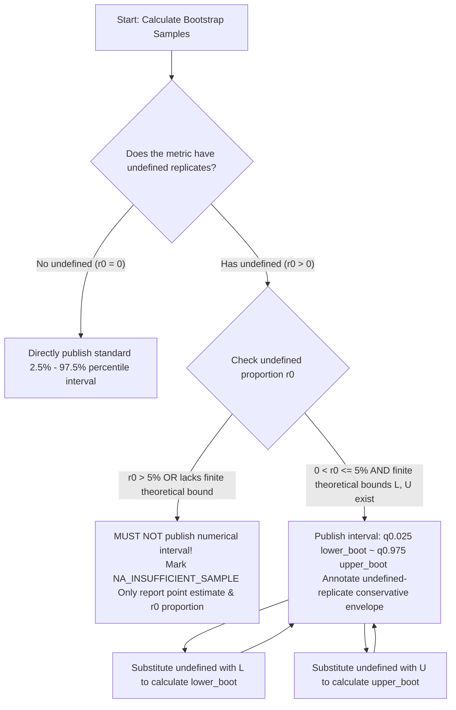

# HAS-GEO: Open-World Hospitality AI Search & GEO Measurement Specification (The DIRECT Framework)

**Specification Version**: Official Release 1.0 (Official Specification)

**Release Date**: 2026-08-07

**Issuing Organization**: Hotel Discovery Lab

**Lead Author**: Andy Chen

**Specification Status**: Open Industry Standard

**Target Audience**: Independent Accommodation Properties (including Hotels/B&Bs/Resorts), Hotel Chain Brands, Hospitality & Tourism Groups, and Third-party GEO Marketing & Think Tank Agencies

**Open Source License**: CC BY-NC-SA 4.0 / Apache 2.0

---

# Layer 1: Executive Summary, Introduction & Core Concepts

## 1. Introduction & Philosophy

### 1.1 From SEO to GEO: The Paradigm Shift in the Generative Search Era
With the rapid rise of Retrieval-Augmented Generation (RAG) driven by Large Language Models (LLMs) and Generative Search Engines (e.g., ChatGPT Search, Google AI Overviews, Perplexity, Claude, Grok, DeepSeek), digital marketing and information distribution are undergoing a massive paradigm shift. We are moving from traditional "blue link" SEO (Search Engine Optimization) to GEO (Generative Engine Optimization), driven by exposure, citation, and trust. In a generative search environment, AI no longer outputs a static list of web links; instead, it dynamically reorganizes and synthesizes multi-channel information from across the web into a natural language response featuring inline citations and entity recommendations.

### 1.2 Reconstruction of the Hospitality Evaluation Paradigm
Under the new generative search mechanism, traditional evaluation methods based on linear rankings on Search Engine Results Pages (SERP) (e.g., "Ranking #1 on Google") have completely failed. The entire hospitality and accommodation industry—whether ranging from luxury to economy tiers, from chain brands to independent properties, or from standard hotels to serviced apartments and boutique B&Bs—urgently requires an open-source evaluation specification that is **fair, objective, reproducible, and tailored to the strong physical constraints of the hospitality industry** when assessing their AI recommendation performance.

This technical whitepaper officially defines and publishes the **HAS-GEO (Hospitality AI Search - Generative Engine Optimization) Evaluation Specification**. This algorithmic system is **rooted in the micro-level causal analysis of Single Properties**, while strategically reserving the capability for **Mapping Aggregation up to the Group/Brand/Chain dimensions** at the algorithm layer. It aims to provide the entire hospitality industry with a dual-layer evaluation capability compatible with both micro-level (property) and macro-level (group/brand) analysis.

### 1.3 Reader Path Map

To facilitate efficient reading for stakeholders with different backgrounds, the HAS-GEO specification provides three targeted reading paths:

| 👨‍💼 Hotel Managers (GM / DOSM) | 💻 Algorithm & Software Engineers | 🔬 Data Scientists & Researchers |
|---|---|---|
| 1. [Introduction & Paradigm Shift](#1-introduction--philosophy) | 1. [Code QuickStart Preview](#27-developer-quickstart-preview) | 1. [Academic Theory Integration](#14-integration-of-frontier-academic-theories) |
| 2. [The DIRECT Framework](#24-physical-structure-of-the-direct-framework) | 2. [Mathematical Derivation of DIRECT](#layer-2-the-direct-profile-standard-metrics) | 2. [Conditional Isolation & Bottom Lines](#3-core-terminology--calculation-principles) |
| 3. [DOSM Action Guide (3-Step)](#26-hotel-report-application-guide-gmdosm-perspective) | 3. [Test Dataset Construction Matrix](#11-benchmark-ai-application-pool--test-dataset-construction) | 3. [Bootstrap Resampling & Confidence Intervals](#14-hierarchical-bootstrap--uncertainty-estimation) |
| 4. [The DIRECT Diagnostic Scorecard](#28-the-direct-diagnostic-scorecard) | 4. [Capture State Machine & Execution](#12-multi-session-repetition--engineering-execution-protocol) | 4. [Extreme Bound Sensitivity Analysis](#143-missingness-sensitivity-analysis-delivered-drr--extreme-bounds) |

- **Path A: General Managers & Marketing Directors (GM / DOSM)**
  Only need to master the core logic of "The DIRECT Framework" and how to interpret the "Diagnostic Scorecard (Profile)" to guide the hotel's GEO strategy adjustments in the AI era. No need to delve into the underlying mathematical derivations.
- **Path B: Algorithm Engineers & R&D Teams (Software & AI Engineers)**
  Focus on the mathematical derivation of metrics and data capture engineering. Master the 6 core Capture States, the multi-wave anti-noise pipeline, and the QuickStart sample code to implement rapid secondary development of the HAS-GEO algorithm.
- **Path C: Data Scientists & Academic Researchers (Data Scientists & Researchers)**
  Dive deep into the statistical mechanisms of the algorithm. Ensure the rigor and reliability of the evaluation results by understanding advanced statistical derivations such as confidence interval estimation, anti-noise design, and extreme bound analysis.

---

### 1.4 Integration of Frontier Academic Theories
The HAS-GEO algorithm was not built in a vacuum. It deeply integrates the top GEO evaluation theories from both academia and industry, specifically transformed for the strong physical constraints of the hospitality industry:

1. **Absorption & Transformation of GEO-bench (KDD 2024)**:
   - **Absorbed Principle**: Adopted its quantitative analysis framework regarding "positional decay of content in generative search engines."
   - **Hospitality Transformation**: Adapted it into the **Discovery Position Score (DPS)**, which aligns with consumer browsing habits (introducing logarithmic attention decay $d(\rho) = \frac{1}{\log_2(1+\rho)}$) to accurately quantify the attention a hotel receives in AI outputs. It **resolutely abandons the pure word-count "Text Share" algorithm**, which is entirely unsuitable for the vertical hospitality industry.
2. **Absorption & Transformation of C-SEO Bench (NeurIPS 2025)**:
   - **Absorbed Principle**: Adopted its macro perspective on "Multi-adopter game-theoretic competition and the evolution of AI competitive landscapes."
   - **Hospitality Transformation**: Introduced **AI Recommendation Concentration (AI-HHI)**, **Territory Share (TS)**, and the **Co-occurrence Substitution Network (Lift)** to reveal the natural brand monopolies and competitor interception relationships formed in AI outputs.
3. **Absorption & Transformation of AutoGEO (ICLR 2026)**:
   - **Absorbed Principle**: Adopted its first principle that "Visibility (GEO Score) and Utility Authenticity (GEU Score) must be decoupled and coordinated."
   - **Hospitality Transformation**: Established the **Decoupling Principle**, and combined with the "high customer complaint sensitivity" bottom line of the hospitality industry, implemented it as two core defensive metrics: **Intersection Rate (IR)** and **Reality Accuracy (RA)**, strictly guarding the red line of hotel brand reputation.

#### 🌟 Core Features & Paradigm Evolution of HAS-GEO vs. Academic Baselines
While the aforementioned generic academic benchmarks (GEO-bench, C-SEO, AutoGEO) made pioneering contributions, they invariably adopted a "Synthetic Single Score / GEO Score" evaluation model. In a vertical industry like hospitality, characterized by strong physical constraints and high complaint risks, a single weighted score suffers from the fundamental limitation of "flaw masking."

HAS-GEO completely shatters the traditional academic black box of a "blunt single weighted score." It **custom-builds a rigorous, high-resolution "Six-Dimensional Stereo Diagnostic System (The DIRECT Framework)" specifically for the accommodation industry for the first time. This system not only accurately maps the real digital marketing conversion funnel but also features built-in systemic anti-bias validations against the unique hallucinations and random noise of Large Language Models (LLMs):**

1. **Discovery ($D$)**: Quantifies the probability and rank-decayed position of a hotel being mentioned and recommended in AI responses (DMR, DRR & DPS);
2. **Intersection ($I$)**: Evaluates whether the recommended hotel truly meets the guest's hard constraints regarding geography and facilities (IR);
3. **Reality ($R$)**: Verifies the objective truth of the natural language statements in the AI's recommendation reasoning to strictly prevent factual hallucinations (RA);
4. **Evidence & Route ($E$)**: Checks whether the AI provided source credentials and tracks whether the guiding links lead to the hotel's official direct booking channels (ER);
5. **Consistency ($C$)**: Measures whether the recommendation results remain stable and anti-jitter across multiple Session retries and phrasing paraphrases (CR);
6. **Territory ($T$)**: Analyzes the brand concentration and co-occurrence substitution network naturally formed in the AI recommendation output (TS & Lift).

**Simultaneously, the algorithm establishes the business evaluation rule of "Penalty Exemption for Un-triggered Branches; Judging Quality Only After Valid Recommendation"**: Generic academic benchmarks (like GEO-bench KDD 2024) focus on evaluating the macro-level return across the entire web, treating un-recommended samples as 0 return, which is entirely reasonable for macro statistics. However, in the micro-level diagnosis of the hospitality vertical, HAS-GEO explicitly marks un-recommended hotels as 'Concept Not Applicable `NA_NOT_APPLICABLE`' rather than forcibly assigning a 0 score in diagnostic dimensions (like Accuracy or Outbound Links). This accurately distinguishes between "Zero Exposure" and "False Statements"—two completely different pathologies—filling a gap in industrial-grade precise GEO diagnosis for vertical industries.

---

## 2. Specification Purpose & Evaluation Philosophy

### 2.1 Specification Purpose: From "Single Quantitative Score" to "Decoupled Diagnosis"

In the early stages of Generative Engine Optimization (GEO), industry developers and hotel managers often naturally clung to traditional KPI thinking, hoping the algorithm would output a "100-point comprehensive score" or "single index," much like a test score, for intuitive management assessment.

However, in the real-world recommendation context based on Large Language Models (LLMs), such a "comprehensive score" not only fails to reflect true performance but also constitutes a severe methodological trap:

1. **Dimensional Non-additivity**:
   "Discovery Exposure" (percentage probability), "Constraint Intersection" (Yes/No/Not Applicable), "Reality Accuracy" (True/False judgment), and "Evidence & Route" (Traffic diversion path) possess entirely different physical meanings. Attempting to forcibly add them via linear weights (e.g., $0.4D + 0.3I + 0.3R$) lacks rational justification in both statistics and information retrieval theory.
2. **Severe Flaw Masking Effect**:
   If a comprehensive score is calculated, a hotel that is **"frequently recommended by AI but contains massive false facility statements (High Exposure + High Hallucination)"** can easily calculate the exact same comprehensive score as a hotel that is **"never recommended by AI (Zero Exposure)."** The former faces severe customer complaints and brand risks, while the latter faces a pure traffic drought. Their pathologies are entirely different, yet a comprehensive score conflates them, masking the true model defects.

Based precisely on this profound analysis of the "Comprehensive Weighted Score Trap," HAS-GEO established the **Decoupling Principle**. This framework completely abandons the practice of forcing a single total score, outputting instead a "Six-Dimensional Diagnostic Profile" where each dimension has independent meaning and non-interfering data:

$$
\large \text{HAS-GEO-Profile} = \left( D, I, R, E, C, T \right)
$$

**The six major dimensions are not simple parallel relationships; rather, they form a diagnostic funnel with strict preconditions.** $D$ (Discovery) is the first physical floodgate of the funnel. Only when the prerequisite of exposure is met will the evaluation of the subsequent five dimensions be triggered. Each dimension represents an independent diagnostic perspective and must absolutely not be forcibly compressed into a single weighted score.

### 2.2 HAS-GEO Core Evaluation & Global Governance Architecture

To bridge the gap from theoretical philosophy to engineering code implementation, and to ensure the absolute rigor of the final output data, this specification adopts a three-dimensional architecture of "Vertical Pipeline & Horizontal Governance":

```text
           [ Execution Pipeline ]                         [ Governance Shield ]

           ┌────────────────────────────────────────────────┐      
  Layer 1  │ 1. Executive Summary, Intro & Core Concepts    │      
           │    (Solves the "Evaluation Philosophy" problem)│      
           └───────────────────────┬────────────────────────┘      
                                   │ (Deduce downwards)                    
                                   ▼                               ┌────────────────────────┐
           ┌────────────────────────────────────────────────┐      │ 4. Stats & Protection  │
  Layer 2  │ 2. The 6D DIRECT Profile Standard Metrics      │ ◄────┤ (Cross-layer Stats     │
           │    (Solves the "Exact calculation" problem)    │      │  Validation)           │
           └───────────────────────┬────────────────────────┘      │ Resolves "Bootstrap    │
                                   │ (Drive data)                  │ intervals & Extreme    │
                                   ▼                               │ Bound Anti-bias"       │
           ┌────────────────────────────────────────────────┐      │                        │
  Layer 3  │ 3. Capture State Machine & Execution Protocol  │ ◄────┤                        │
           │    (Solves the "Automated Data Capture" issue) │      └────────────────────────┘
           └────────────────────────────────────────────────┘      
```

#### 1. Meaning of the Four Major Layers
- **Layer 1 (Executive Summary, Intro & Core Concepts)**: Defines the evaluation background, academic origins, decoupling philosophy, the DIRECT framework, generic hierarchical mapping, and reader guides. **Answers the question of "Why evaluate this way."**
- **Layer 2 (The DIRECT Profile Standard Metrics)**: Provides exact mathematical formulas, applicable conditions, and state determinations for the six DIRECT metrics ($D, I, R, E, C, T$) on a single hotel property ($h$). **Answers the question of "How to calculate the metrics."**
- **Layer 3 (Data Capture, State Machine & Execution)**: Defines the target AI application pool, multi-lingual dataset construction matrix, the Capture 6-State machine, entity resolution protocols, and the $N_{total} \ge 5$ resampling pipeline. **Answers the question of "How to run the engineering."**
- **Layer 4 (Statistical Derivation & Advanced Protection)**: Provides Bootstrap-based confidence interval estimation, Extreme Bounds for missing values (Delivered DRR), Multi-comparison controls (FWER), and Edge Case suites. **Answers the question of "How to statistically validate and prevent errors."**

#### 2. Architecture Logic
The first three layers follow a forward pipeline sequence: **\"Theoretical Guidance ➔ Metric Definition ➔ Engineering Capture\"**. However, Layer 4 (Advanced Protection) is not the next step on the pipeline; it is the **statistical cornerstone and parallel shield** of the entire system. It cuts across horizontally, applying significance validation to data collected in Layer 3 and imposing extreme bound constraints on the results calculated in Layer 2, preventing metrics from being polluted by random noise and thereby forming an unbreakable engineering closed-loop.

### 2.3 The Core System: The DIRECT Framework

In the era of Generative Search, for a hotel to stand out in AI recommendations, its GEO performance must perfectly align with the six major evaluation dimensions of **DIRECT**. HAS-GEO pioneers this groundbreaking DIRECT measurement framework:

| Dimension | Name (DIRECT) | Core Question Answered | Diagnostic Nature |
|---|---|---|---|
| $D$ | **D**iscovery Visibility | Is the hotel recommended? How early does it appear? How much positive display? | **Exposure Layer** (Traffic Funnel) |
| $I$ | **I**ntersection | Does the recommended hotel's actual facilities have a perfect intersection with the guest's hard constraints? | **Match Layer** (Demand Fit) |
| $R$ | **R**eality | How many objective statements made by the AI about the hotel are factually supported? Are there hallucinations? | **Trust Layer** (Factual Reality) |
| $E$ | **E**vidence & Route | What evidence does the user see? Does the link lead to official properties or direct booking paths? | **Conversion Layer** (Route & Evidence) |
| $C$ | **C**onsistency | Are the results stable and anti-jitter across retry sessions and phrasing paraphrases? | **Systemic Check** (Temporal Anti-fragility) |
| $T$ | **T**erritory | What brand concentration and territory division naturally form in the AI output? | **Systemic Check** (Spatial Brand Moat) |

### 2.4 Physical Structure of the DIRECT Framework

The six dimensions are not simple flat or one-way linear relationships, but form a three-dimensional physical architecture consisting of a **"4D User Conversion Funnel + 2D Systemic Macro Check"**:

```text
========================================================================================
                      【 The DIRECT Framework 】
========================================================================================

    [ Core Route: 4D User Conversion Funnel ]       [ Systemic Cornerstone: 2D Macro ]

 1. Exposure Layer (Top)                                    
    D (Discovery): Visibility ────────────────┐
    (Traffic gate, funnel prerequisite)       │
                                              ▼         ►  C (Consistency)
 2. Trust Layer (Middle)                      │            Temporal Stability
    I (Intersection): Demand Fit ─────────────┼            (Anti-fragility)
    R (Reality): Factual Objectivity ─────────┤
    (Build trust, prevent hallucination)      │
                                              ▼         ►  T (Territory)
 3. Conversion Layer (Bottom)                 │            Competitive Landscape
    E (Evidence): Route & Credentials ────────┘            (Brand Moat)
    (Guide official booking, monetization end)                     

========================================================================================
```

#### Core Design Philosophy: Asymmetric Funnel
Sensually, the Exposure layer ($D$) occupies a massive proportion (containing three high-frequency metrics: DMR, DRR, DPS) and is extremely cheap to measure. In contrast, the lower layers $I, R, E$ are relatively singular and extremely costly to measure (requiring physical Ground Truth validation). This "top-heavy" structure is not a design flaw, but an **asymmetric inevitability** conforming to real business laws:
1. **High Granularity of the Traffic Opening**: $D$ determines the traffic ceiling, and exposure itself has multiple forms (mentions, recommendations, rank-decayed position), requiring high-resolution metric breakdown.
2. **Veto Power of Bottom-layer Defenses**: Although $I$ (Condition Mismatch) and $R$ (Factual Hallucination) are less numerous than $D$, they possess **Veto Power** in commercial risk, determining the brand's reputation baseline.
3. **Validating the Decoupling Principle**: Precisely because of this massive measurement asymmetry, it once again proves the absolute correctness of HAS-GEO's refusal to **"calculate a comprehensive weighted score."** If forcibly weighted, the massive scores from $D$ would absolutely mask fatal hallucination risks.

#### Core Diagnostic Rules
- **$D$ (Discovery) is the physical floodgate**: If $D = 0$ (AI never recommended the hotel), then $I$, $R$, and $E$ are directly marked as `NA_NOT_APPLICABLE`.
- **$I$ and $R$ are the Brand Safety Nets**: High Exposure ($D$) + Low Objectivity ($R$) or Mismatch ($I$) means the hotel is being falsely advertised by the AI, which could trigger severe guest complaints!
- **$E$ is the Commercial Monetization Endpoint**: Having exposure and trust without an official direct booking path ($E$) means traffic will leak to third-party OTA platforms. This not only burdens the hotel with high distribution commissions but also forfeits guest data ownership and introduces severe competitor price-matching and traffic diversion risks within the OTA platform, drastically slashing the final profit margin of GEO.

### 2.5 Universality: Property First, Hierarchical Mapping

To ensure this algorithm can be universally applied by independent hotels, chain brands, and hotel groups alike, HAS-GEO adopts a universal architecture of **"Single Property Calculation + Cascading Mapping Matrix"**:

$$
\text{Single Property ID} \xrightarrow{\quad\text{Map}\quad} \text{Brand ID} \xrightarrow{\quad\text{Map}\quad} \text{Group ID}
$$

1. **Usage by Independent Hoteliers**: The mapping table is populated with only their 1 hotel, outputting the complete Profile diagnosis directly for that single property.
2. **Usage by Chain Groups/Brands**: Import the `Entity_Tapping.csv` mapping table for their portfolio. After calculating each single property, the algorithm automatically and seamlessly aggregates upwards to output the brand-wide macro data and the global group leaderboard.

### 2.6 Hotel Report Application Guide (GM/DOSM Perspective)

When the evaluation report is delivered to the Hotel General Manager (GM) or Director of Sales & Marketing (DOSM), read and act upon it using the following three steps:

1. **Step 1: Check $D$ (Recommendation Rate DRR & Ranking DPS) to optimize top-of-funnel traffic.**
   - Evaluate whether the hotel gets recommended in target scenarios. If DRR $< 5\%$, the hotel is disconnected from the AI's knowledge base. You must fill in structured data across the web and increase crawling nodes.
2. **Step 2: Check $I$ (Hard Constraints) & $R$ (Accuracy) to avoid guest mismatch and drive systemic GEO optimization.**
   - If $I$ (Intersection) or $R$ (Reality) shows a Fail, it means an "Entity Memory Drift" has occurred within the LLM's foundational knowledge graph. Simply updating the official website is no longer enough to reverse AI hallucinations. You must launch **Technical GEO optimization**:
     - **Corpus Remediation**: Audit and purge dirty data sources across the public web (e.g., outdated PR, stale OTA reviews, erroneous UGC) that cause RAG retrieval errors.
     - **Entity Alignment**: Inject standardized facts (Fact Injection) into foundational knowledge graphs and high-weight corpus nodes.
     - **Semantic Density**: Build a RAG-friendly content architecture, high-frequency reinforcing the semantic associations of real core selling points to overwrite the AI's false memories from the bottom up.
3. **Step 3: Check $E$ (Route) to guide official direct booking channels.**
   - Assess whether links lead to third-party OTAs or direct to the hotel's **official website/app**. If all are OTA links, open the official booking pages' OpenGraph and JSON-LD tags to search engines to intercept direct booking traffic.

### 2.7 Developer QuickStart Preview

To help open-source developers understand the SDK invocation mechanism, the standard algorithm invocation and Profile output pseudocode is as follows:

```python
from hasgeo import Pipeline

# 1. Load study configuration and entity mapping table (Property -> Brand -> Group)
pipeline = Pipeline(config="study_config.yaml", mapping="Entity_Tapping.csv")

# 2. Concurrently dispatch API capture (T >= 5 Sessions for anti-noise resampling)
captures = pipeline.run_capture(engines=["chatgpt", "gemini", "perplexity"], repetitions=5)

# 3. Settle the 6D Profile and export a polished HTML diagnostic report
profile = pipeline.evaluate(captures)
profile.to_html_report("hospitality_diagnosis_report.html")
```

---

### 2.8 The DIRECT Diagnostic Scorecard

The final settlement output of the algorithm MUST be formatted and presented as the following standard **Single Property Scorecard**. It serves as the full health check report of a hotel's AI performance:

| Property | Engine | Total Samples ($N$) | $D$: Mention (DMR) | $D$: Recommend (DRR) | $D$: Attention (DPS) | $I$: Intersection (IR) | $R$: Reality (RA) | $E$: Direct Route (ER) | $C$: Consistency (CR) | $T$: Territory Share (TS) | Overall Diagnostic Status |
|---|---|---|---|---|---|---|---|---|---|---|---|
| **Example Hotel A** | ChatGPT-5.6 | 15 ($5\times3$) | **93.3%** (14/15) | **86.7%** (13/15) | 0.82 (Avg Rank 1.2) | 92.0% (Pass) | 95.5% (High) | **60.0%** (Direct) | 0.88 (Stable) | **22.5%** (Head) | 🟢 **Healthy** (High Exposure/Direct) |
| **Example Hotel B** | Perplexity | 15 ($5\times3$) | **80.0%** (12/15) | **40.0%** (6/15) | 0.35 (Avg Rank 4.5) | **60.0%** (Fail 2) | 70.0% (3 Hallucinations) | **0.0%** (100% OTA) | 0.42 (Unstable) | **5.0%** (Marginal) | 🟡 **Warning** (High Mention, Low Recommend) |
| **Example Hotel C** | Gemini 3.6 | 15 ($5\times3$) | **0.0%** (0/15) | **0.0%** (0/15) | 0.00 (Unseen) | `NA` | `NA` | `NA` | `NA` | **0.0%** | 🔴 **Blind Spot** (Un-indexed) |

---

### 2.9 Cross-Dimensional Analysis Rules

The 6-dimensional column data in the report never exists in isolation. It reveals deep-seated problems for hotels within AI search engines through the following **four cross-dimensional linkage rules**:

```
                    ┌────────────────────────────────────────────────────────┐
   1. Traffic Leak  │ High DRR + 0% ER ──► Traffic hijacked by OTA comms!    │
                    └────────────────────────────────────────────────────────┘
                    ┌────────────────────────────────────────────────────────┐
   2. Guest Trap    │ High DRR + Low IR ─────► Mismatched guests, complaints!│
                    └────────────────────────────────────────────────────────┘
                    ┌────────────────────────────────────────────────────────┐
   3. Brand Crisis  │ High DRR + Low RA ─────────► AI hallucinating falsely! │
                    └────────────────────────────────────────────────────────┘
                    ┌────────────────────────────────────────────────────────┐
   4. Fragility     │ High DRR + Low Consistency ────► Occasional/Jittery!   │
                    └────────────────────────────────────────────────────────┘
```

1. **Traffic & Conversion Disconnect ($D \rightarrow E$ Linkage)**:
   - When DRR is high (e.g., $>50\%$) but ER is 0% (all OTA links): This indicates the hotel has captured AI traffic, but **the commercial value is entirely hijacked by third-party OTAs**! **Action**: Launch a direct-sales linkage recapture plan. Instruct the tech team to deploy RAG-friendly website architectures and booking channel tracking to intercept leaking traffic.
2. **High Exposure & Guest Complaint Trap ($D \rightarrow I$ Linkage)**:
   - When DRR is high but IR is low or shows a Critical Fail: This indicates the AI is frequently pushing guests with mismatched requirements to the hotel (e.g., sending guests seeking a pool to a hotel without one). **Action**: Launch a web-wide corpus purge. Instruct the tech team to identify and erase dirty data sources in public LLMs causing retrieval misalignment to block potential complaints.
3. **High Exposure & Brand Hallucination Rule ($D \rightarrow R$ Linkage)**:
   - When DRR is high but Reality Accuracy (RA) is low (AI hallucinates fake facilities or prices): This indicates **the AI is generating false advertising**. **Action**: Conduct authoritative entity alignment. Instruct the tech team to inject standard facts into the underlying knowledge graph to overwrite the LLM's false memories from the ground up.
4. **Recommendation Consistency Rule ($D \rightarrow C$ Linkage)**:
   - When DRR is high but CR is low: This indicates the recommendation is extremely unstable and highly sensitive to minor semantic variations in the prompt, classifying it as an **occasional recommendation**. **Action**: Strengthen brand semantic density. Instruct the tech team to enhance content coverage across all channels to improve the hotel's stability in the AI's latent vector space.

## 3. Core Terminology & Calculation Principles

### 3.1 Glossary of Core Terminology

- **Open-World Evaluation**: An evaluation paradigm for LLMs that does not preset a fixed "golden standard" list or closed candidate set. It does not dictate which hotels the AI *must* recommend prior to testing. Instead, it extracts all accommodation entities from the AI's response post-test and dynamically incorporates them into the observation universe. This design ensures absolute fairness across all independent hotels, boutique properties, and major conglomerates.
- **Capture**: A single raw response record obtained by executing one complete Prompt query under fixed system and test conditions.
- **Session (Independent Run)**: Independent request repetitions under identical test conditions, used to measure memory-less random fluctuations.
- **Recommendation Entity Block (Inline Mention Point)**: The independent accommodation entity recommendation position contained within an AI response (analogous to a display card slot on a SERP, appearing as a text block containing the entity in generative text).
- **Claim (Factual Assertion)**: The smallest verifiable objective proposition with an independent truth value extracted from the response.
- **Cell (Stratification Unit)**: The smallest planned analytical grid determined by crossing conditions such as Scenario $s$, Prompt variation $p$, and Wave $b$.
- **Typed-NA (Categorized Missing State)**: Bare `NA` or the number 0 MUST NOT be used to fill missing values. Precise types must be explicitly marked, such as `NA_CAPABILITY` (Platform capability missing) or `NA_NOT_APPLICABLE` (Concept not applicable).
- **JSON Serialization Anti-NaN Protocol**: When a dimension is in a `NA_NOT_APPLICABLE` or `UNKNOWN` state, the exported Profile JSON must explicitly assign it as `null`. It MUST NOT write the floating-point `NaN` or the string `"NaN"`, ensuring cross-language SDK compatibility (Python / TypeScript / Rust).

### 3.2 Penalty Exemption for Un-triggered Branches (Conditioned Evaluation Rules)

In commercial diagnosis, evaluation must strictly align with real business logic. Generic academic benchmarks (like GEO-bench, C-SEO, AutoGEO) focus on evaluating an entity's comprehensive web-wide return, counting un-recommended instances as a 0 score. However, in HAS-GEO vertical industry diagnosis, to accurately isolate irrelevant factors and prevent pathology misjudgment, the algorithm mandates three business rules under the 'Penalty Exemption for Un-triggered Branches':

```
                                 ┌── 1. VALID_RECOMMENDATION ──► Enters Discovery Denominator (Score DRR)
                                 │
Input Query (Capture) ── Eval ───┼── 2. VALID_REFUSAL ─────────► Enters Discovery Denominator (Score DRR = 0)
                                 │
                                 └── 3. INVALID_TECHNICAL ─────► MUST NOT Enter Denominator! (Retry/Drop)
```

1. **Unseen $\neq$ Error**: If a hotel does not appear in the response, its Discovery score is 0. However, subsequent conditional dimensions like Fit, Reality, and Route MUST be marked as `NA_NOT_APPLICABLE`. **They MUST NOT be imputed with 0 points for implicit penalty.**
2. **Missing Capability $\neq$ Poor Performance**: If a platform lacks the capability to display citations or links, it is marked as `NA_CAPABILITY`. **It MUST NOT be scored a 0 on the Route metric.**
3. **Technical Failure $\neq$ Refusal to Recommend**: Network timeouts or broken responses are marked as `INVALID_TECHNICAL`. **They MUST NOT be counted as DRR = 0**. They must either be retried or completely purged from the valid Capture denominator.

---

# Layer 2: The DIRECT Profile Standard Metrics

## 4. $D$ - Discovery Visibility (Primary Result)

The Discovery dimension is a pure "traffic counter." It only focuses on whether the hotel appeared in the AI's response and at what ranking position. Whether the AI's reasons for recommendation are true (handled by the $R$ dimension), or whether the booking links provided are official (handled by the $E$ dimension), is entirely disregarded during the $D$ dimension phase. This is the core manifestation of HAS-GEO's "Decoupling Principle."

### 4.1 Discovery Recommendation Rate (DRR)

#### 1. Business Meaning
Evaluates the standardized probability that the Generative AI engine proactively recommends the target hotel (or group) as a qualified positive option to the user under the pre-registered scenario panel.

#### 2. Standard Calculation Formula
The formula for the Cell-standardized Conditional DRR (abbreviated as DRR) of hotel $h$ is:

$$
\large \text{DRR}_h = \frac{\sum_{u} w_u Z_u Q_{hu}}{\sum_{u} w_u Z_u} = \sum_{\substack{s,p,b \\ T^{\text{valid}}_{s,p,b}>0}} \pi_s \varpi_{p\mid s} \tau_b \left[ \frac{\sum_{t:Z_u=1} Q_{hu}}{T^{\text{valid}}_{s,p,b}} \right]
$$

Note: The expanded form only sums over Cells where $T^{\text{valid}}_{s,p,b} > 0$. If all samples in a Cell suffer from technical failures ($T^{\text{valid}} = 0$), that Cell is naturally excluded on the left side due to $w_u = 0$, and similarly skipped by the conditional summation on the right side; both sides are strictly equivalent. If all Cells have no valid samples, DRR is marked as `INCOMPLETE`.

#### 3. Parameter Dictionary

In the calculation formula above, each parameter not only has a rigorous mathematical definition but is also deeply tied to actual business engineering execution:

1. **$h$ and $u$ (Base Entity Parameters)**
   - **Meaning**: $h$ represents the target hotel (Property) currently being diagnosed; $u$ represents a single independent API sampling record (Capture) in the global test.
   - **Source**: $h$ originates from the user-pre-registered target entity list; $u$ originates from the unique request tracking ID generated by the automated capture system.
   - **Engineering Impact**: They constitute the 2D base matrix dimension (Hotel $\times$ Session) of the entire evaluation framework, determining the statistical granularity of the final results.

2. **$Q_{hu} \in \{0,1\}$ (Recommendation Indicator)**
   - **Meaning**: Boolean value. In a single capture $u$, if the LLM explicitly recommends hotel $h$ as a positive or viable alternative option to the user, then $Q_{hu} = 1$; otherwise, it is $0$.
   - **Source**: Derived via text extraction computed by a backend LLM-as-a-Judge or Entity Resolution module on the raw response.
   - **Engineering Impact**: This is the **core numerator** of the entire formula. The more accurate the $Q_{hu}$ judgment, the higher the authenticity of the recommendation reflected by DRR.

3. **$w_u = \pi_s \cdot \varpi_{p\mid s} \cdot \tau_b$ (Comprehensive Traffic Weight)**
   - **Meaning**: The absolute importance weight of a single capture. It is the product of the Scenario traffic weight ($\pi_s$), the Prompt variant frequency weight within that scenario ($\varpi_{p\mid s}$), and the Time-wave weight ($\tau_b$).
   - **Source**: **MUST be pre-registered (Preregistration)** based on the **Destination-level** public search volume and OTA macro-intent distribution. **It is strictly forbidden to reverse-engineer weights using a single hotel's private GA data.**
   - **Engineering Impact**: Upgrades DRR from a "simple arithmetic mean" to a "real market-weighted probability." In Open-World evaluations, this objective "macro weight" ensures absolute fairness for all hotels recalled by the AI.

4. **$Z_u \in \{0,1\}$ (Network Validity Constraint Switch)**
   - **Meaning**: Boolean value. Indicates whether single capture $u$ successfully obtained a complete and uncorrupted API response. A successful return is 1; network crashes, timeouts, or API refusal errors are 0.
   - **Source**: Generated in real-time by the HTTP status code detection and Exception Catch modules underlying the request scheduling engine.
   - **Engineering Impact**: This is the **denominator control switch** of the formula. It ensures that request losses caused by LLM vendor technical failures are not implicitly penalized as "un-recommended." Discarded data where $Z_u=0$ will be automatically removed from the denominator to guarantee statistical fairness.

5. **$T^{\text{valid}}_{s,p,b}$ (Valid Capture Anti-Jitter Base)**
   - **Meaning**: The total number of successfully completed valid repetitive sessions (Sessions) under a specific scenario $s$, prompt $p$, and time wave $b$. The HAS-GEO specification mandates $T^{\text{valid}} \ge 5$.
   - **Source**: Dynamically counted by subtracting technical failures ($Z_u=0$) from the preset concurrent repetition count in the experimental scheduling script.
   - **Engineering Impact**: This is the physical defense line to eliminate LLM **output randomness (hallucination jitter caused by Temperature)**. The larger the value of $T$, the narrower the confidence interval of the final DRR score, and the stronger the anti-jitter and anti-cheat capabilities.

> 💡 **Python Expression**: `drr_h = sum(w_u * Z_u * Q_hu) / sum(w_u * Z_u)`

#### 4. Applicable Conditions & State Determination
- **Applicable Conditions**: Applies to all valid Captures ($Z_u = 1$), including normal responses, normal non-recommendations, and refusals.
- **State Determination Rules**:
  1. If the recommendation stance in the response is $Y_{hu} \in \{\text{POSITIVE, CONDITIONAL, ALTERNATIVE}\}$, then $Q_{hu} = 1$;
  2. If the hotel does not appear (`NOT_MENTIONED`), is neutrally listed (`NEUTRAL`), explicitly excluded (`NEGATIVE`), or the stance is unresolved (`MIXED`), the valid Capture gets $Q_{hu} = 0$;
  3. If the Capture is a technical failure (`INVALID_TECHNICAL`), then $Z_u = 0$ and it does not enter the denominator.

#### 5. Weighting Schema & Example
In engineering implementation, the traffic weights at all levels (e.g., $\pi_s$, $\varpi$) must follow the **"Sum to 1.0 (Intra-layer normalization)"** principle, usually injected into the SDK via a `study_config.yaml` configuration file before code execution.

Below is a standard configuration example showing how to slice search intent weights based on destination macro data (e.g., 60% business travelers, 40% family leisure travelers):

```yaml
# study_config.yaml (HAS-GEO Pre-registered Weight Matrix)

# 1. Scenario Macro Weight (pi_s), must sum to 1.0
scenarios:
  s1_business_travel:
    name: "Business Travel"
    weight: 0.60  # Macro data indicates 60% of search intent is business
    
    # 2. Prompt Variant Weight under Scenario (varpi_p|s), must sum to 1.0 within the scenario
    prompts:
      - text: "Recommend the best business hotels in London near the West End."
        weight: 0.70  # Landmark-heavy searches account for 70% of business intent
      - text: "London luxury hotels with fast wifi and meeting rooms."
        weight: 0.30  # Facility-heavy searches account for 30% of business intent

  s2_family_vacation:
    name: "Family Vacation"
    weight: 0.40  # Macro data indicates 40% of search intent is family vacation
    
    prompts:
      - text: "Family friendly hotels in London with a large pool."
        weight: 1.00  # Only one core prompt designed for this scenario
```

> 💡 **Best Practice Tip**: According to the HAS-GEO specification, developers **MUST freeze this YAML file before running any code**. It is strictly forbidden to "tamper" with the weights to artificially boost a specific hotel's score after seeing the AI batch results (this constitutes severe "post-hoc target drawing" cheating).

---

### 4.2 Discovery Mention Rate (DMR)

#### 1. Business Meaning
Counts the probability of a hotel being substantially mentioned in any form (including descriptions, comparisons, and exclusions) in the response. Used in conjunction with DRR (which only looks at positive recommendations) to identify hotels with "high discussion but low recommendation."

#### 2. Standard Calculation Formula

$$
\large \text{DMR}_h = \frac{\sum_u w_u Z_u H^{\text{mention}}_{hu}}{\sum_u w_u Z_u}
$$

Where:

$$
H^{\text{mention}}_{hu} = \mathbf{1}(Y_{hu} \neq \text{NOT-MENTIONED})
$$

#### 3. Applicable Conditions
- **Applicable Conditions**: Applies to all valid Captures ($Z_u = 1$).

---

### 4.3 Discovery Position Score (DPS) & Ranking Metrics

#### 1. Standard Calculation Formula & Metric Relationships

These three metrics constitute a complete **Position Metrics system**. They **share the exact same denominator** (i.e., the total request base where "ranking is valid") and present a structure extending from global quality expectation down to specific intervals.

Define the position applicability indicator $B^{\text{pos}}\_{hu} = \mathbf{1}\left( Q\_{hu}=0 \lor (Q_{hu}=1 \land \kappa_{hu}=1) \right)$. Under the premise of position interpretability:

**① Core Metric: Discovery Position Score (DPS)** 
The most comprehensive continuous expected score, smoothing all recommended positions based on the "user attention decay law". The higher the rank, the higher the score.
Adopts a logarithmic position decay $d(\rho) = \frac{1}{\log_2(1+\rho)}$:
> 💡 **Extraction Rule**: For ordered lists or paragraphs generated in natural language, assign $\rho=1,2,3...$ incrementally by entity appearance order; for parallel syntax, e.g., "Recommend A, B, and C", treat as unordered `UNRANKED`, do not calculate DPS or assign uniform same-level Rank.

$$
\large \text{DPS}_h = \frac{\sum_{u:Z\_u=1,B^{\text{pos}}_{hu}=1,Q_{hu}=1} w_u d(\rho_{hu})}{\sum_{u:Z_u=1,B^{\text{pos}}_{hu}=1} w_u}
$$

**② Derivative Metrics: TopKRate and FirstPositionRate**
Measures the probability of a hotel appearing in the golden visibility zone (e.g., Top 3 or Top 5) or occupying the "absolute first position", respectively.
Can be viewed as a special case where the decay function $d(\rho)$ in DPS is replaced by step indicator functions $\mathbf{1}(\rho\le k)$ and $\mathbf{1}(\rho=1)$:

$$
\large \text{TopKRate}_h = \frac{\sum_{u:Z_u=1,B^{\text{pos}}_{hu}=1,Q_{hu}=1} w_u \mathbf{1}(\rho_{hu}\le k)}{\sum_{u:Z_u=1,B^{\text{pos}}_{hu}=1} w_u}
$$

$$
\large \text{FirstPositionRate}_h = \frac{\sum_{u:Z_u=1,B^{\text{pos}}_{hu}=1,Q_{hu}=1} w_u \mathbf{1}(\rho_{hu}=1)}{\sum_{u:Z_u=1,B^{\text{pos}}_{hu}=1} w_u}
$$

#### 2. Parameter Dictionary

In the position metrics system, to ensure the rigor of ranking statistics, the formula introduces the following key control variables:

1. **$Q_{hu} \in \{0,1\}$ (Recommendation Indicator)**
   - **Meaning**: Same as Section 4.1. Only records where $Q_{hu}=1$ and the position is applicable can earn a positive ranking score in the numerator; un-recommended cases where $Q_{hu}=0$ score 0, but enter the denominator as "unranked" failures, pulling down the average.

2. **$\kappa_{hu} \in \{0,1\}$ (Rankability Indicator)**
   - **Meaning**: Indicates whether the content returned by the LLM has a discernible "sequential order." If the response is a structured ordered list (e.g., 1. 2. 3.) or clearly arranged paragraphs, then $\kappa_{hu}=1$; if presented as unordered prose or compact parallels (e.g., "A, B, and C are all good"), the algorithm cannot infer sequential preference, and $\kappa_{hu}=0$.

3. **$B^{\text{pos}}_{hu} \in \{0,1\}$ (Position Applicability Indicator)**
   - **Meaning**: A control switch determining whether the current evaluation record is eligible to enter the **denominator** of the statistics.
   - **Core Logic**: Only two situations count as "applicable"—either the hotel was never recommended ($Q_{hu}=0$); or the hotel was recommended AND the position is crystal clear ($Q_{hu}=1 \land \kappa_{hu}=1$). If the hotel was recommended but mixed in un-rankable text, to prevent arbitrarily assigning ranks and polluting the evaluation data, this event will NOT be counted in the DPS denominator.

4. **$\rho_{hu} \in \mathbb{N}^+$ (Absolute Rank Position)**
   - **Meaning**: The absolute sequential order of the hotel in the recommendation list, extracted via text parsing.
   - **Example**: The 1st recommended hotel in the response has $\rho_{hu}=1$ (first position), the 2nd has $\rho_{hu}=2$, and so on. This value is the direct input for subsequent decay function calculations.

5. **$d(\rho)$ (Attention Discount Function)**
   - **Meaning**: Adopts the classic logarithmic decay penalty from the information retrieval field $d(\rho) = \frac{1}{\log_2(1+\rho)}$ to simulate the law of user attention loss when browsing results.
   - **Discount Example**: 1st place is not discounted (1.0 points), 2nd place decays to 0.63 points, 3rd place to 0.5 points, and 7th place leaves only 0.33 points.

6. **$w_u, Z_u$ (Base Weight and Network State)**
   - Same as Section 4.1, representing macro traffic weight and request validity, respectively.

#### 3. Applicable Conditions & State Determination
- **Applicable Conditions**: Applies to valid events where display positions are rankable or explicitly un-recommended.
- **State Determination Rules**:
  1. Un-recommended events ($Q_{hu}=0$) definitely score 0 for position and enter the denominator;
  2. If a hotel is recommended but belongs to unordered prose or parallel cards ($\kappa_{hu}=0$), it is marked as `UNRANKED` and does not enter the position metric denominator;
  3. If all Captures are recommended but all are `UNRANKED`, the metric state is marked as `UNKNOWN_UNVERIFIABLE`.

---

## 5. $I$ - Constraint Intersection (Conditional Diagnosis)

Constraint Intersection only evaluates whether hotels that have *already* been qualifiedly recommended satisfy the explicit hard constraints pre-registered in the Prompt.

### 5.1 Constraint Pass Rate & Verification Coverage

#### 1. Business Meaning
Evaluates the objective fulfillment ratio of AI-recommended hotels against explicit hard constraints such as geography, price, and facilities.

#### 2. Standard Calculation Formula
Let the hard constraint weights satisfy $\sum_{k \in \mathcal{K}\_s} \lambda_k = 1$. For a recommended hotel $h$, define the verifiable indicator $E_{huk} = \mathbf{1}(X_{huk} \in \{\text{Pass, Fail}\})$:

$$
\large \text{IR}_{hu} =
\begin{cases}
\frac{\sum_{k \in \mathcal{K}_s} \lambda_k \mathbf{1}(X_{huk}=\text{Pass})}{\sum_{k \in \mathcal{K}_s} \lambda_k E_{huk}}, & \text{if } \sum \lambda_k E_{huk} > 0 \\
\text{UNKNOWN-UNVERIFIABLE}, & \text{otherwise}
\end{cases}
$$

> 💡 **Python Expression**: `ir = sum(lambda_k * (X_k == "Pass")) / sum(lambda_k * (X_k in ["Pass", "Fail"]))`

$$
\large \text{ConstraintCoverage}_{hu} =
\begin{cases}
\frac{\sum_{k \in \mathcal{K}_s} \lambda_k E_{huk}}{\sum_{k \in \mathcal{K}_s} \lambda_k \mathbf{1}(X_{huk} \neq \text{NotApplicable})}, & \text{if } \sum \lambda_k \mathbf{1}(X_{huk} \neq \text{NotApplicable}) > 0 \\
\text{NA-NOT-APPLICABLE}, & \text{otherwise}
\end{cases}
$$

#### 3. Parameter Dictionary

To granularly evaluate whether the LLM "understood" the "hard requirements" in the instruction, this formula introduces the following constraint discrimination parameters:

1. **$\mathcal{K}_s$ and $k$ (Hard Constraint Set and Single Constraint)**
   - **Meaning**: $\mathcal{K}_s$ represents all hard conditions explicitly proposed to the AI in the Prompt within the current query scenario $s$ (e.g., "Must have a pool," "In the West End," "Price under £200"). $k$ is one specific constraint among them.

2. **$\lambda_k$ (Hard Constraint Weight)**
   - **Meaning**: The business importance of a single constraint, satisfying $\sum_{k \in \mathcal{K}_s} \lambda_k = 1$.
   - **Role**: Not all requirements are equally important (e.g., "geographic location mismatch" is often far more severe than "no double breakfast provided"). Introducing weights calculates a comprehensive satisfaction rate more aligned with human intuition.

3. **$X_{huk} \in \{\text{Pass, Fail, Unknown, NotApplicable}\}$ (Constraint Judgment State)**
   - **Meaning**: The performance of the recommended hotel $h$ on constraint $k$ in single session $u$.
   - **Source**: Usually derived by an LLM-as-a-Judge cross-referencing the hotel's authentic external knowledge base (Ground Truth).

4. **$E_{huk} \in \{0,1\}$ (Verifiable Indicator)**
   - **Meaning**: Determines whether the current constraint "has enough evidence to judge whether it is satisfied or violated."
   - **Role**: This is a critical protection mechanism in the formula. Only when $X_{huk}$ is explicitly `Pass` (satisfied) or `Fail` (violated) does $E_{huk}$ equal 1, and the constraint enters the calculation. If the state is `Unknown` (e.g., AI recommended a hotel, but it cannot be verified in either the LLM output or the knowledge base whether it actually has a pool), $E_{huk}$ equals 0, and this portion of the weight is stripped from the denominator. This ensures the evaluated object is not wrongfully penalized due to "insufficient evidence."

5. **$\text{IR}_{hu}$ (Constraint Pass Rate)** and **$\text{ConstraintCoverage}_{hu}$ (Verification Coverage)**
   - **$\text{IR}_{hu}$** calculates: Among all constraints where the truth is **known**, what is the proportion of the hotel passing?
   - **Coverage** calculates: In this scenario, what proportion of the constraints successfully **revealed the truth**? If Coverage is too low (i.e., massive Unknowns), it indicates that the confidence level of the IR score for this evaluation is very low.

#### 4. Applicable Conditions & State Determination
- **Applicable Conditions**: Only targets hotels that have received a qualified recommendation ($Q_{hu}=1$). Unseen hotels are marked `NA_NOT_APPLICABLE` and are not penalized.
- **State Determination Rules**:
  1. Constraint judgment uses tri-state logic: `Pass` / `Fail` / `Unknown`;
  2. If evidence is insufficient (e.g., using straight-line distance to judge walking requirements), it MUST be judged `Unknown` and not automatically passed;
  3. If the number of verifiable items in the denominator is 0, `IR` is marked as `UNKNOWN_UNVERIFIABLE`.

---

### 5.2 Critical Violation Risk

#### 1. Business Meaning
Monitors whether the recommended option violated negative hard constraints pre-registered as `critical=true` (e.g., must include wheelchair access).

#### 2. Standard Calculation Formula
Determine the recommended event's Critical state $C^{\text{crit}}_{hu} \in \{\text{FAIL, UNKNOWN, PASS, NA-NOT-APPLICABLE}\}$ by priority. Evaluate violation rates and risk bounds:

$$
\large \text{CriticalViolationRate}^{\text{evaluated}}_h = \frac{\sum_u w_u Z_u Q_{hu} I^{\text{crit,app}}_{hu} I^{\text{crit,eval}}_{hu} \mathbf{1}(C^{\text{crit}}_{hu}=\text{FAIL})}{\sum_u w_u Z_u Q_{hu} I^{\text{crit,app}}_{hu} I^{\text{crit,eval}}_{hu}}
$$

$$
\large \text{RiskyRecommendationJoint}^{L/U}_h = \frac{\sum_{u:Z_u=1,I^{\text{crit,risk}}_u=1,Q_{hu}=1} w_u \mathbf{1}(C^{\text{crit}}_{hu} \in \{\text{FAIL / FAIL+UNKNOWN}\})}{\sum_{u:Z_u=1,I^{\text{crit,risk}}_u=1} w_u}
$$

#### 3. Parameter Dictionary

Unlike ordinary hard constraints, a critical violation (e.g., must have wheelchair access, must allow pets), once triggered, causes the entire recommendation to fail disastrously. Thus, the formula introduces a specialized risk parameter system:

1. **$C^{\text{crit}}_{hu} \in \{\text{FAIL, PASS, UNKNOWN, NA}\}$ (Critical Violation State)**
   - **Meaning**: The performance of the LLM-recommended hotel on the critical constraint. `FAIL` means stepping on the bottom line (e.g., strictly prohibiting pets but recommending it anyway), `PASS` means clearing safely.

2. **$I^{\text{crit,app}}_{hu}$ and $I^{\text{crit,eval}}_{hu}$ (Applicability & Evaluable Indicator)**
   - **Meaning**: $I^{\text{crit,app}}_{hu}$ judges whether the current recommendation is "applicable" to the critical constraint assessment (e.g., if the prompt didn't have a critical constraint at all, or the hotel wasn't recommended, it evaluates to 0).
   - **Role**: $I^{\text{crit,eval}}_{hu}$ is similar to the anti-misjudgment mechanism in the previous section, specifically intercepting the `UNKNOWN` state. Multiplying by it in the denominator of the `CriticalViolationRate` formula guarantees that the absolute violation rate is only calculated within the sample pool where "the truth has been ascertained."

3. **$I^{\text{crit,risk}}_u \in \{0,1\}$ (Session-level Risk Indicator)**
   - **Meaning**: Judges whether the Prompt in single request $u$ contains a high-risk constraint with `critical=true`. This is used as a denominator switch in the second Joint formula to ring-fence the entire "high-risk evaluation macro pool."

4. **$L/U$ (Lower/Upper Risk Bound Envelope)**
   - **Meaning**: A special statistical method to handle massive `UNKNOWN`s (missing information) in the real world.
   - **Logic**: In the second Joint formula, if we take an optimistic stance and only treat conclusive `FAIL`s as violations, we calculate the **Lower Bound ($L$)** of the risk; if we adopt an extremely conservative stance, assuming "as long as it is uncertain (`UNKNOWN`), treat it as a potential violation," we calculate the **Upper Bound ($U$)** of the risk.

#### 4. Applicable Conditions & State Determination
- **Applicable Conditions**: Only applicable when the scenario contains Critical constraints ($I^{\text{crit,risk}}_u=1$) and the hotel is recommended.
- **State Determination Rules**: Critical violations operate on a "one-strike veto system." Any Critical FAIL must NOT be offset by excellent performance in other metrics (like the hotel being very luxurious or cheap).

---

## 6. $R$ - Reality (Conditional Diagnosis)

Reality only evaluates the objective Claim accuracy of natural language reasons within qualified recommendation events.

### 6.1 Verified Claim Reality (RA) & Claim Coverage

#### 1. Business Meaning
Evaluates how many objective atomic statements made by the AI for recommendation reasons (e.g., "has an indoor pool, 200m from subway") are supported by authentic evidence.

#### 2. Standard Calculation Formula
Atomic Claim classification counts: $N_S$ (Supported), $N_C$ (Contradicted), $N_O$ (Outdated), $N_I$ (Source Conflict), $N_U$ (Unverifiable). Subjective Claims do not enter the calculation.

$$
\large \text{RA}_{hu} = \frac{N_S}{N_S + N_C + N_O + N_I}
$$

> 💡 **Python Expression**: `ra = N_supported / (N_supported + N_contradicted + N_outdated + N_source_conflict)`

> 💡 **Design Note**: $N_I$ (Source Conflict) is included in the denominator but not counted as supported. "Source conflict" means at least one authoritative source believes the Claim is flawed. In hotel complaint risk management, a conservative estimate should be adopted—treating conflicts as "suspected inaccuracies" rather than "undecidable." If implementers have sufficient reason to believe source conflicts shouldn't affect accuracy, they can configure `ra_include_source_conflict: false` in `study_config.yaml` to revert to a denominator without $N_I$, but this must be explicitly annotated in the report.
$\large \text{ClaimCoverage}_{hu} = \frac{N_S + N_C + N_O + N_I}{N_S + N_C + N_O + N_I + N_U}$

#### 3. Parameter Dictionary

The core of this formula suite lies in fact-checking and classifying the "Objective Claims" within the LLM's generated reasons. The meanings of the variables are as follows:

1. **$N_S$ (Supported)**
   - **Meaning**: The statement perfectly matches the Ground Truth in the knowledge base (e.g., AI says "200 meters from subway," external data verification confirms it is indeed within 200m). It is the sole contributor of positive score in the calculation.

2. **$N_C$ (Contradicted)**
   - **Meaning**: The statement explicitly conflicts with knowledge base content (classic "LLM Hallucination"). This is the primary factor causing Accuracy (RA) to drop.

3. **$N_O$ (Outdated)**
   - **Meaning**: The statement provided by the AI used to be correct but has now expired (e.g., "Provides free airport shuttle," but in fact, this service was canceled last year). This is equally treated as providing false information.

4. **$N_I$ (Source Conflict)**
   - **Meaning**: When cross-referencing multiple authoritative knowledge sources, contradictions are found among the sources themselves (e.g., official website says there is a pool, but latest OTA data says the pool is under maintenance). As per the Design Note above, based on conservative risk management, it is generally treated as a penalty item lowering recommendation confidence.

5. **$N_U$ (Unverifiable)**
   - **Meaning**: Pertains to statements lacking external comparison data to falsify or confirm.
   - **Role**: $N_U$ is extremely critical; it does not enter the denominator of $\text{RA}$ to avoid wrongfully penalizing the LLM. However, it constitutes a part of $\text{ClaimCoverage}$. If an entire paragraph of recommendation reasons is built purely on fabricated and unverifiable details, Coverage will plummet rapidly, exposing the "baseless" risk at the factual level of that recommendation.

> 💡 **Note**: Subjective Claims such as "This hotel is very luxurious," "excellent scenery," cannot undergo fact-checking and must be filtered out early in data processing, not participating in any of the above statistics.
#### 4. Applicable Conditions & State Determination
- **Applicable Conditions**: Only targets recommended events containing objective Claims.
- **State Determination Rules**:
  1. If the recommendation event has no objective Claims at all, both metrics are marked `NA_NOT_APPLICABLE`;
  2. If objective Claims exist but are all unverifiable ($N_S + N_C + N_O + N_I = 0$), RA is marked `UNKNOWN_UNVERIFIABLE`, and Coverage is marked 0; it MUST NOT be assigned 0.50 or imputed as passed.

---

## 7. $E$ - Evidence & Route (Conditional Diagnosis)

Only analyzes the retrieval sources, citations, and associated links actually displayed in the response; it does not guess the internal hidden retriever.

### 7.1 Citation Coverage & Citation Support Precision

#### 1. Business Meaning
Evaluates whether objective assertions in the AI response annotate visible citations, and whether the citation genuinely supports the assertion.

#### 2. Standard Calculation Formula

$$
\large \text{CitationCoverage}_{hu} = \frac{N_{\text{objective claims with displayed citation}}}{N_{\text{objective claims}}}
$$

$$
\large \text{CitationSupport}_{hu} = \frac{N_{\text{evaluated cited claim pairs supported}}}{N_{\text{evaluated cited claim pairs}}}
$$

#### 3. Parameter Dictionary

This metric suite aims to quantify the **"Coverage"** and **"Fidelity"** of the AI when citing external sources, involving the following counting parameters:

1. **$N_{\text{objective claims}}$ (Total Objective Assertions)**
   - **Meaning**: The total volume of objective statements extracted from the AI recommendation reasons that can undergo fact-checking (equivalent to the sum of all objective Claims in Section 6.1). The denominator base.

2. **$N_{\text{objective claims with displayed citation}}$ (Assertions with Displayed Citations)**
   - **Meaning**: Among the objective statements above, the number of statements explicitly annotating a citation source on the UI interface (e.g., displayed via superscript `[1]` or outbound link). This directly determines **Citation Coverage**.

3. **$N_{\text{evaluated cited claim pairs}}$ (Total Evaluated "Assertion-Citation" Pairs)**
   - **Meaning**: Among all assertions with citations, the number of pairs where the target webpage's original text was successfully scraped and fed to the evaluator (LLM Judge) for cross-verification.
   - **Explanation**: Sometimes cited webpages might 404 or encounter anti-scraping blocks, making evaluation impossible. These "dead links" will not enter the support rate denominator, avoiding collateral damage.

4. **$N_{\text{evaluated cited claim pairs supported}}$ (Assertions Supported by Citations)**
   - **Meaning**: After verification, the original content of the citation **genuinely and verifiably** proves the objective assertion made by the AI. This calculates the **Citation Support Precision**, used to combat the AI hallucination behavior of "forging citations, bait-and-switch."

#### 4. Applicable Conditions & State Determination
- **State Determination Rules**: If the AI platform being tested (e.g., base model without internet access) inherently lacks the function to retrieve and display citations, both metrics are marked as `NA_CAPABILITY`; if the platform supports this function (e.g., Perplexity, AI Overviews) but obstinately provides no citations for the current response, Coverage is calculated as 0.

---

### 7.2 Official Source Presence & Official Booking Path

#### 1. Business Meaning
Evaluates whether the user saw an official property/group credential source, and whether the associated link directs to an official, executable booking deep link.

#### 2. Standard Calculation Formula
Given that the platform possesses display capabilities ($K^{\text{off}}_u=1, K^v_u=1$), the conditional presence rate and end-to-end joint rate are:

$$
\large \text{OfficialSourcePresence}_{h\mid Q} = \frac{\sum_{K^{\text{off}}=1,Q=1} w_u Z_u E^{\text{off}}_{hu}}{\sum_{K^{\text{off}}=1,Q=1} w_u Z_u}, \qquad \text{OfficialSourcePresenceJoint}_h = \frac{\sum_{K^{\text{off}}=1} w_u Z_u J^{\text{off}}_{hu}}{\sum_{K^{\text{off}}=1} w_u Z_u}
$$

> 💡 **Python Expression**: `official_presence = sum(w_u * Z_u * E_off) / sum(w_u * Z_u)`

$$
\large \text{Route}^v_{h\mid Q} = \frac{\sum_{K^v=1,Q=1} w_u Z_u R^v_{hu}}{\sum_{K^v=1,Q=1} w_u Z_u}, \qquad \text{Route}^{v,\text{joint}}_h = \frac{\sum_{K^v=1} w_u Z_u J^v_{hu}}{\sum_{K^v=1} w_u Z_u}
$$

#### 3. Parameter Dictionary

This metric suite evaluates whether a hotel brand can successfully route traffic to "official proprietary channels" (rather than being hijacked by OTAs) within generative results.

1. **$K^{\text{off}}_u$ and $K^v_u \in \{0,1\}$ (Platform Capability Indicators)**
   - **Meaning**: Represent respectively whether the currently tested AI platform possesses the capabilities to "display external link sources" and "display booking deep link cards."
   - **Role**: Acts as an applicability switch. If the platform is purely text-based (lacking outbound link capabilities), it is directly marked as `NA_CAPABILITY` and excluded from the denominator calculations. This prevents the hotel's score from artificially dropping due to the platform's lack of function.

2. **$E^{\text{off}}_{hu} \in \{0,1\}$ (Official Credential Presence Indicator)**
   - **Meaning**: When recommending the hotel, did the AI provide a visible link/source pointing to the hotel's official website or the parent group's official domains?

3. **$R^v_{hu} \in \{0,1\}$ (Official Booking Deep Link Indicator)**
   - **Meaning**: Does the link provided by the AI direct to the hotel's official, executable booking page (Deep Link)? If the link routes to third-party OTA channels like Expedia or Booking.com, this item is 0.

4. **Conditional Rate ($h \mid Q$) & Joint Rate (Joint)**
   - **Conditional Rate** (left side of formulas): Specifically examines "Given that the AI **recommended** this hotel, what is the probability it included an official link?" The denominator is restricted to samples where $Q_{hu}=1$.
   - **Joint Rate** (right side of formulas, i.e., $J^{\text{off}}_{hu}, J^v_{hu}$): Examines "Across **all exposure opportunities** this hotel received, what is the absolute comprehensive probability of being both recommended AND carrying an official link?" This is the final result of funnel conversion.

- **State Determination Rules**: When a link lands on a third-party OTA, it is solely logged as `OTAPropertyPage` and earns no points; only when it lands on an officially executable booking deep link (e.g., official website booking details page) is $R^v_{hu} = 1$ recorded. If the tested AI platform lacks outbound link capabilities, it is uniformly marked as `NA_CAPABILITY`.

## 8. $C$ - Consistency (Conditional Diagnosis)

The consistency dimension contains two orthogonal sub-metrics, measuring two entirely different sources of instability:

| Sub-metric | Measurement Target | Core Question |
|---|---|---|
| CR | Multiple independent requests of the same Prompt | Does the model's Temperature sampling noise cause recommendation set jitter? |
| Paraphrase Robustness | Semantically equivalent but differently phrased Prompts | Does the recommendation set change drastically after rephrasing the question? |

A model can have perfect CR (asking the exact same sentence 5 times yields identical results) but abysmal Paraphrase Robustness (rephrasing the question yields completely different hotels). The two must be calculated and reported independently.

### 8.1 Same-wave CR (Intra-wave Session Stability)

#### 1. Business Meaning
Evaluates the overlap of recommendation sets across multiple independent requests under identical conditions (same scenario $s$, same Prompt variant $p$, same wave $b$). Measures the random noise introduced by the model's Temperature sampling.

#### 2. Standard Calculation Formula
For $n \ge 2$ valid repetitions within the same wave, calculate the pairwise Jaccard mean of the authentic hotel recommendation sets:

$$
\large J(u,u') = \frac{|\mathcal{R}_u \cap \mathcal{R}_{u'}|}{|\mathcal{R}_u \cup \mathcal{R}_{u'}|}, \qquad \text{CR}_{s,p,b} = \frac{2}{n(n-1)} \sum_{u < u'} J(u,u')
$$

> 💡 **Note**: Iff $|\mathcal{R}\_u \cup \mathcal{R}\_{u'}| = 0$ and both responded normally without errors, define $J(\emptyset, \emptyset) = 1$
#### 3. Parameter Dictionary

1. **$n$ (Valid Intra-wave Repetitions)**
   - **Meaning**: The number of times identical test requests are sent for the exact same Prompt within a very short time window (same wave $b$).
   - **Role**: The larger $n$ is, the more accurately the LLM's underlying random noise is measured.

2. **$u$ and $u'$ (Independent Test Sessions)**
   - **Meaning**: Represent any two independent sessions among the $n$ repeated tests above.
   - **Role**: The $\sum_{u < u'}$ in the formula dictates "pairwise" calculations across these $n$ results (e.g., testing 5 times yields 10 pairwise combinations).

3. **$\mathcal{R}_u$ (Recommendation Set)**
   - **Meaning**: The actual list of authentic hotels recommended by the AI in session $u$.

4. **$J(u,u')$ (Pairwise Jaccard Similarity)**
   - **Meaning**: The "intersection size" divided by the "union size" of two recommendation lists. If the two recommended hotel lists are exactly the same, the score is 1; if there is zero overlap, the score is 0.

#### 4. Applicable Conditions & State Determination
- **State Determination Rules**: If the number of valid repetitions $n < 2$, the state is marked as `NA_INSUFFICIENT_SAMPLE`; the overlap of empty authentic hotel lists can be 1, but must be displayed in conjunction with Yield.

---

### 8.2 Paraphrase Robustness

#### 1. Business Meaning
Evaluates the consistency of the recommendation set and the Top-1 recommendation across Prompt variants that are semantically identical but syntactically different. Measures the model's sensitivity to surface phrasing changes—if a user changes "find me a business hotel near Heathrow" to "business accommodation recommendations around Heathrow airport" and the results change drastically, the recommendation is extremely fragile.

#### 2. Standard Calculation Formula

For $P \ge 2$ synonymous paraphrase variants $\{p_1, p_2, \ldots, p_P\}$ under the same base scenario $s$, within the same wave $b$, calculate the following two sub-metrics respectively:

**2a. Paraphrase Set Robustness**

Take the union (majority vote set) of the authentic hotels recommended by each variant $p$ across all valid Sessions, denoted as that variant's representative recommendation set $\overline{\mathcal{R}}_{s,p,b}$. Calculate the pairwise Jaccard mean across all variants:

$$
\large \text{ParaphraseSetRobustness}_{s,b} = \frac{2}{P(P-1)} \sum_{p < p'} J(\overline{\mathcal{R}}_{s,p,b},\, \overline{\mathcal{R}}_{s,p',b})
$$

> 💡 **Python Expression**: `paraphrase_robustness = mean(jaccard(R_p, R_p_prime) for p, p_prime in combinations(paraphrases, 2))`

**2b. Paraphrase Top-1 Agreement**

Take the most frequent Top-1 recommended hotel (the mode) for each variant $p$ across all valid Sessions, denoted as $\hat{h}^{(1)}_{s,p,b}$. Calculate the agreement rate of the Top-1 recommendation across all variants:

$$
\large \text{ParaphraseTop1Agreement}_{s,b} = \frac{2}{P(P-1)} \sum_{p < p'} \mathbf{1}\left(\hat{h}^{(1)}_{s,p,b} = \hat{h}^{(1)}_{s,p',b}\right)
$$

#### 3. Parameter Dictionary

1. **$P$ (Total Synonymous Paraphrase Variants)**
   - **Meaning**: The number of Prompts with different rhetorical or syntactical structures designed for the same search intent (scenario $s$).

2. **$p$ and $p'$ (Specific Paraphrase Variants)**
   - **Meaning**: Any two different sentence structures among the $P$ variants above. The formula similarly pairs them pairwise ($\sum_{p < p'}$) to calculate the average deviation.

3. **$\overline{\mathcal{R}}_{s,p,b}$ (Representative Recommendation Set / Majority Vote Set)**
   - **Meaning**: This is a crucial denoising step. Before measuring syntactical robustness, the random fluctuations caused by the model's own Temperature must first be excluded. Therefore, we take the "union" (or a thresholded majority vote set) of all hotels appearing in multiple tests for variant $p$ as the final representative set for that variant, before comparing Jaccards with other variants.

4. **$\hat{h}^{(1)}_{s,p,b}$ (Mode Top-1 Recommendation)**
   - **Meaning**: The hotel that dominated the 1st place (Top-1 recommendation) the most times across multiple tests for variant $p$.
   - **Role**: The indicator function $\mathbf{1}(\dots)$ in Formula 2b is extremely stringent. It requires that no matter how you rephrase the question, not only must the recommendation lists be similar, but **the "Center-Stage Hotel" occupying the top spot MUST be the exact same one**, otherwise it scores 0 directly.

#### 4. Applicable Conditions & State Determination
- **Applicable Conditions**: Only applicable when the base scenario $s$ is equipped with $P \ge 2$ synonymous paraphrase variants.
- **State Determination Rules**:
  1. If the number of paraphrase variants $P < 2$, the state is marked as `NA_INSUFFICIENT_PARAPHRASE`;
  2. If all Sessions for a variant within that wave are technical failures, that variant is excluded from pairwise calculation; if remaining valid variants $< 2$, handle as above;
  3. When all Sessions for a variant yield no recommendations ($\overline{\mathcal{R}}_{s,p,b} = \emptyset$), it follows the exact same $J(\emptyset, \emptyset) = 1$ definition as CR.

---

### 8.3 Implementation Guidelines & Parameter Settings

Although the first two sections of Chapter 8 provide rigorous algebraic definitions, the following parameter settings and operational bottom lines must be adhered to during real engineering batch tests to ensure the evaluation results are statistically meaningful and fair:

#### 1. Recommended Repetitions ($n$) and Variants ($P$)
- **Intra-wave Repetitions ($n$)**: To accurately capture the LLM's Temperature Variance, $n=1$ is strictly forbidden. **It is recommended to set $n$ between 3 and 5**. For top-tier brand lock-in tests demanding extreme precision, it is advised to increase to $n=10$.
- **Number of Paraphrase Variants ($P$)**: For the same base scenario $s$, **it is recommended to preconfigure at least 3 different expressive variants** (e.g., colloquial phrasing, concise keyword stacking, complex prompts with pre-assigned personas).

#### 2. "Offline Pre-registration" & "Intent Freezing" Principles for Test Sets
- **Offline Pre-registration**: The variant Prompts used to test Paraphrase Robustness MUST be **pre-generated and frozen into the database** during the test suite construction phase. It is strictly forbidden to call LLMs for real-time, dynamic random rewrites during automated test execution. Dynamic rewrites lacking a fixed baseline lead to completely irreproducible test results.
- **Constraint Equivalence Bottom Line**: Paraphrasing can only alter surface rhetoric, word order, and syntax. **It MUST NOT add, delete, or tamper with the original "hard constraints" (e.g., price, geography, core facilities)**.
  - *Bad Example*: Rewriting the original sentence "business hotels near Heathrow with an indoor pool" into "better business accommodation around Heathrow" (dropping the "pool" hard constraint constitutes a test case design failure). This will cause extreme metric distortion, wrongfully blaming the target LLM for being unstable.

#### 3. Cross-Regional & Environmental Controls
Beyond literal Prompt paraphrasing, real AI search engines (like Google AI Overviews, Bing Chat) conduct severe "hyper-personalized" interventions. In enterprise-grade engineering batch execution, stability testing must cover isolation against the following physical environments:
- **Geographic Robustness (IP Drift)**: The automated test framework must support dynamically configuring a Proxy Pool. Due to LBS (Location-Based Services) weighting, searching for the identical "nearby hotels" using a Paris IP vs. a London IP will easily generate massive geographic drift. In cross-border or continental evaluations, different IP nodes must be treated as independent test domains.
- **Profile & Context Robustness**: The multi-turn conversational memory of LLMs will contaminate subsequent independent tests. Automated batch programs MUST implement **strict Stateless Sessions**, meaning Context and Cookies are forcefully reset before every query; if evaluating "hyper-personalization" effects specifically, test accounts representing different persona profiles must be isolated to strictly prevent "memory crosstalk" between test cases.

---

## 9. $T$ - Territory Structure (Market Concentration) ?— Structural Diagnosis

> [!IMPORTANT]
> **Evaluation Paradigm Declaration: Absolute Health Metrics vs. Relative Zero-Sum Game**
> *   **Chapters 1-8** belong to "Absolute Health Metrics", applicable to any broad Open-world scenario (e.g., "evaluating the macro performance of all hotels in London"). No matter how vast the scenario, each hotel can independently calculate its own absolute scores for exposure rate, accuracy, etc., without interfering with others.
> *   **Chapter 9** belong to "Relative Zero-Sum Game Metrics". It is a surgical tool specifically designed for **"Customized Competitive Analysis."** Calculating market share (TS) and monopoly degree (HHI) MUST be conducted within **extremely convergent, clearly bounded micro-scenarios** (e.g., exclusively ring-fencing the "Luxury Business Hotel Competitive Set around Hyde Park, London"). If Chapter 9 is forcibly applied to broad, unbounded macro tests, because there are too many participants and their customer bases don't overlap (like calculating youth hostels and ultra-luxury hotels together), all shares will be infinitely diluted, rendering the calculated concentration completely devoid of business guiding value.

### 9.1 TS, AI-HHI, & Co-recommendation Lift

#### 1. Business Meaning
Analyzes the naturally formed entity block share distribution, recommendation concentration, and co-occurrence substitution network between hotels/groups in AI outputs.

#### 2. Standard Calculation Formula
- **Territory Share (TS)**: Calculated based on an exhaustive and mutually exclusive underlying recommended entity block classification $C(q)$:

  

$$
\large \text{TS}_i =
\begin{cases}
\frac{\sum_u w_u Z_u \\#\{q \in \mathcal{A}_u : C(q)=i\}}{\sum_u w_u Z_u |\mathcal{A}_u|}, & \text{if } \sum_u w_u Z_u |\mathcal{A}_u| > 0 \\
\text{NA-NOT-APPLICABLE}, & \text{otherwise}
\end{cases}
$$

- **AI Recommendation Concentration (AI-HHI)**: All-block $\text{AI-HHI}^{\text{all}} = \sum_{g \in \mathcal{G}^*} \text{TS}_g^2$. Stripping out everything except authentic hotels yields the internal concentration $\text{AI-HHI}^H$.
- **Co-occurrence Lift**: $\text{Lift}\_{ij} = \frac{p_{ij}}{p_i p_j}$ (Only displayed when unweighted co-occurrence frequency meets the threshold).

#### 3. Business Logic Relationships of the Three Major Formulas
These three formulas act as three mirrors characterizing the AI recommendation market landscape (the traffic pie) from micro to macro:
1. **TS (Entity Share)**: Answers **"Who cut how big a piece of the pie?"** It calculates what percentage of all recommendation slots generated by the AI are occupied by a certain hotel group or brand.
2. **AI-HHI (Recommendation Concentration)**: Answers **"Is this pie monopolized by a few big brands?"** It borrows the classic antitrust metric HHI (sum of squared market shares) from economics. The higher the HHI, the more the LLM acts like a "parrot," obsessively pushing only a few top hotels (extreme Matthew effect, leaving no room for niche hotels); the lower the HHI, the more "diverse and blossoming" the LLM's recommendations are.
3. **Lift (Co-occurrence Network)**: Answers **"At this table, who are the fierce rivals (alternatives)?"** If the Lift between Hotel A and Hotel B is extremely high, it means the LLM subconsciously binds them tightly together; whenever it recommends A, it will highly likely bring up B (indicating that in the AI's eyes, they are fighting for the exact same customer base).

#### 4. Parameter Dictionary

1. **$C(q)=i$ and $|\mathcal{A}_u|$ (For the TS Formula)**
   - **$\mathcal{A}_u$**: The total number of all parsed "recommendation slots" within a single AI response (Denominator).
   - **$C(q)=i$**: How many of those slots belong to the target block $i$ (e.g., $i$ could be all hotels in the "Marriott Group") (Numerator).
   - **Meaning**: Calculates a brand's "market share" from the perspective of AI traffic.

2. **$\text{AI-HHI}^{\text{all}}$ and $\text{AI-HHI}^H$ (For the HHI Formula)**
   - **$\text{AI-HHI}^{\text{all}}$**: The absolute concentration incorporating the shares of all components (including authentic hotels, OTA cards, and un-rankable filler text).
   - **$\text{AI-HHI}^H$**: Excludes OTAs and filler text, recalculating the 100% share **exclusively within the pure pool formed by authentic hotels**, then summing the squares. This accurately reflects the intensity of involution strictly among hotel brands.

3. **$p_i, p_j$ and $p_{ij}$ (For the Lift Formula)**
   - **$p_i, p_j$**: The independent probability of Hotel $i$ and Hotel $j$ being recommended separately (i.e., DRR from Chapter 1).
   - **$p_{ij}$**: The joint probability of both hotels **appearing together in the exact same LLM response**.
   - **Role**: $\text{Lift}\_{ij} = \frac{p\_{ij}}{p_i p_j}$ is a classic algorithm in association rule mining. If Lift > 1, the LLM considers them "strong correlated alternatives"; if Lift < 1, the LLM views them as "mutually exclusive" (e.g., if it recommends an ultra-luxury hotel, it won't recommend an economy chain).

#### 5. Applicability & Scenario Boundaries
- **State Determination Rules**: If there are no valid responses or zero recommendations, TS is marked as `NA_NOT_APPLICABLE`.
- **Scenario Granularity Limit**: Just as real-world antitrust investigations must first define the "relevant market," the TS and HHI metrics **are extremely dependent on customized, fine-grained Bounded Scenarios** to yield business value.
  - **Incorrect Usage**: Calculating HHI in "whole UK hotel reviews" or generalized regional scenarios will make the base too large, stripping the data of defensive meaning (because any single property or brand's share will be infinitely diluted).
  - **Correct Usage**: MUST be calculated within a specific sub-category or business district (e.g., "Luxury business hotels around Hyde Park, London"). Only when the "macro pool" is precisely constrained do the calculated monopoly shares and co-occurrence Lift possess direct strategic guiding value for specific properties or brands.
- **Extreme Warning**: TS calculates the "exposure share of AI-generated content." NEVER equate this with actual "market booking share" or "financial revenue share" when reporting to management.

---

## 10. Brand & Group Aggregation Protocol

To ensure that the metric descriptions for single hotel properties remain minimalist and pure, all base metrics in Layer 2 default to calculations based on the **single hotel property ($h$)**. When macro evaluations are required for a **Hotel Brand ($b$)** or **Hotel Group ($g$)**, they MUST be mandatorily executed via the `Entity_Tapping.csv` mapping table in the configuration file, enforcing the following upward aggregation protocol:

$$
\text{Single Property } h \xrightarrow{\quad\text{Map}\quad} \text{Brand } b \xrightarrow{\quad\text{Map}\quad} \text{Group } g
$$

**`Entity_Tapping.csv` Format Definition**:
The file must contain, and only contain, the following standard column names (case-sensitive):
- `property_id`: Unique identifier for the single hotel (Required)
- `property_name_local`: Full hotel name in local language (Used for matching parsing)
- `property_name_en`: Full hotel name in English (Used for cross-lingual matching parsing)
- `brand_id`: Unique identifier for the parent brand (Used for aggregation)
- `brand_name`: Brand name
- `group_id`: Unique identifier for the parent group (Used for aggregation)
- `group_name`: Group name

---

### 1. Group/Brand DRR Upward Aggregation Operators (Reach vs. Gross Mentions)

Because the underlying data is tabulated based on single hotel properties ($h$), when aggregating up to the group ($g$) level, the following two statistical operators from different business perspectives are provided to satisfy diverse analytical needs:

**1a. Group Reach (De-duplicated)**
Measures "whether it entered the user's line of sight." As long as at least one authentic hotel belonging to the group appears in a Session, it counts as 1 valid reach, capped at 1 count per search. The metric's upper limit is strictly capped at 100%.

$$
\large Q_{gu} = \mathbf{1}\left( \exists h \in \mathcal{R}_u : G(h)=g \right), \qquad \text{Reach}_g = \frac{\sum_u w_u Z_u Q_{gu}}{\sum_u w_u Z_u}
$$

> 💡 **Python Expression**: `reach_g = sum(w_u * Z_u * (any(G(h) == g for h in R_u))) / sum(w_u * Z_u)`

**1b. Group Gross Mentions (Cumulative Exposure)**
Follows a pure "underlying single-property mapped accumulation" logic, without de-duplication. If a single response recommends 5 Marriott hotels, it genuinely counts as 5 exposures. This metric represents the absolute total volume of slots the group secures in an average single recommendation, and **the value can exceed 100%**.

$$
\large \text{GrossMentions}_g = \sum_{h \mid G(h)=g} \text{DRR}_h
$$

> 💡 **Python Expression**: `gross_mentions_g = sum(drr_h for h in all_hotels if G(h) == g)`

#### Parameter Dictionary
- **$G(h)=g$**: Property-level mapping function. By reading the external `Entity_Tapping.csv` mapping table, it determines whether single hotel $h$ belongs to target group $g$.
- **$\text{Reach}_g$ (De-duplicated Reach Rate)**: The existential quantifier $\exists$ enforces per-session de-duplication. It answers: "What percentage of users in the macro pool saw **at least one** Marriott hotel?"
- **$\text{GrossMentions}_g$ (Cumulative Total Exposure)**: Pure linear addition logic. It directly sums the DRRs of the underlying single hotels, answering: "Adding up the total exposure of all single properties under the Marriott group, how many slots on average does it occupy per query?" This perfectly reflects the rigorous bottom-up mapping relationship.

---

### 2. Group/Brand Reality Upward Aggregation Perspectives (Claim-micro vs. Event-macro)
When aggregating factual accuracy at the group or brand level, the following two standardized statistical perspectives are provided. The chosen perspective MUST be explicitly annotated when publishing the report:

- **Claim-micro (Micro-assertion Perspective)**: Uses every adjudicable Claim generated across all recommended hotels under the group as the denominator unit:

  

$$
\large \text{RA}^{\text{claim-micro}}_g = \frac{\sum_u w_u Z_u \sum_{h \in \mathcal{H}_{g,u}^Q} N_{S,hu}}{\sum_u w_u Z_u \sum_{h \in \mathcal{H}_{g,u}^Q} (N_{S,hu}+N_{C,hu}+N_{O,hu})}
$$

- **Event-macro (Macro-event Perspective)**: Averages using each qualified recommended hotel event under the group as the denominator unit. To prevent Simpson's Paradox, it is recommended to introduce a threshold truncation $\mathbf{1}(N_{\text{adj},hu} \ge \tau)$, meaning only events meeting the minimum number of valid verifiable Claims are included:

  

$$
\large \text{RA}^{\text{event-macro}}_g = \frac{\sum_u w_u Z_u \sum_{h \in \mathcal{H}_{g,u}^Q} \mathbf{1}(N_{\text{adj},hu}\ge\tau) \text{RA}_{hu}}{\sum_u w_u Z_u \sum_{h \in \mathcal{H}_{g,u}^Q} \mathbf{1}(N_{\text{adj},hu}\ge\tau)}
$$

#### Parameter Dictionary
- **$\mathcal{H}_{g,u}^Q$ (Subset of actually tested hotels hitting the group)**: In session $u$, the set of hotels that were genuinely recommended by the AI AND confirmed to belong to group $g$.
- **Business Meaning of Claim-micro**: Equivalent to a "communal pot" algorithm. It dumps all hundreds of factual judgments (supported, contradicted, outdated) generated across all recommended hotels of the group into one giant pool to calculate a unified total accuracy rate. **Pain point**: It easily gets skewed by single "star hotels described with extreme verbosity by the AI" (e.g., if a flagship hotel contributes 50 factual assertions alone, it heavily masks the errors and omissions of dozens of ordinary hotels).
- **Business Meaning of Event-macro**: Equivalent to "averaging per head." First, calculate the independent RA accuracy for each hotel (e.g., Hotel A 80%, Hotel B 90%), and then average these percentages. This is the most common perspective in commercial reports, truly reflecting a brand's "overall average quality control level."
- **$N_{\text{adj},hu} \ge \tau$ (Confidence Truncation Threshold)**: Since the macro perspective calculates an average of percentages, it encounters a fatal statistical issue (derived from Simpson's Paradox): if the AI is extremely terse regarding Hotel C, uttering only one sentence (yielding only 1 verifiable Claim), and it happens to hallucinate, Hotel C's accuracy instantly becomes 0%, which would instantly crash the entire group's average score. Therefore, the formula introduces threshold $\tau$ (e.g., setting $\tau=3$) to forcefully filter out isolated recommendation events where "the generated information volume is too low and highly circumstantial," ensuring the statistical confidence of the group's overall average score.

---

# Layer 3: Data Collection, States & Execution Pipeline

## 11. Benchmark AI Application Pool & Test Dataset Construction

### 11.1 Target AI Engines Pool

To ensure the test results are representative across the industry and open-source community, HAS-GEO categorizes evaluation targets into two independent evaluation surfaces, **which MUST NOT be cross-mixed or averaged**:

#### 1. API Benchmark Panel (Environment parameters freezable, absolutely reproducible)
Primarily used for academic research, algorithm comparison, and standard rankings. *(Note: Because LLMs iterate extremely fast, the list below serves only as representative examples at the time of the whitepaper's release; actual engineering batch runs should always align with the current SOTA models)*

> [!WARNING]
> **Model Classification Isolation Warning (Standard vs. Reasoning)**
> When executing and publishing benchmark test results, **Standard Conversational Models** (e.g., GPT-5.6, Claude 5.0) and **Reasoning-enhanced Models** (e.g., OpenAI O3 series) MUST be listed separately on leaderboards. Because reasoning models possess a special hidden Chain of Thought mechanism, their performance baselines on Hard Constraint Intersection (I), Consistency (C), and Factual Hallucination Rate (R) differ fundamentally from traditional models. Mixing both into a single leaderboard for averaging or comparison will cause the GEO evaluation to lose benchmark fairness.

The current benchmark pool includes the following mainstream AI search engines and generative applications:
- **OpenAI**: ChatGPT API (GPT-5.6, O3 series, including Web Search enabled state)
- **Google**: Gemini API (Gemini 3.6 Flash, including Google Search Grounding)
- **Anthropic**: Claude API (Claude 5.0)
- **Perplexity AI**: Perplexity API (Sonar, Sonar Pro Search)
- **xAI**: Grok API (Grok 4.5)
- **Google Search**: Google AI Overviews (SGE API scraping surface)
- **DeepSeek**: DeepSeek API (DeepSeek V4 Flash, 67B)
- **Microsoft Copilot**: Microsoft Copilot API (Copilot, including Web Search enabled state)

#### 2. Consumer UI Sentinel Panel (Real product ecosystem, independent sentinel monitoring)
Targeting the Web browser interfaces and App clients used by real users (e.g., ChatGPT Web UI, Perplexity Web App, Google Gemini UI), employing an independent Sentinel panel for monitoring. Because UI interfaces are heavily influenced by backend A/B testing, account history, and personalization, the UI Sentinel only outputs descriptive reports and does not enter the primary API leaderboard.

---

### 11.2 Multilingual Benchmark Dataset Construction Protocol

The test dataset natively supports global multilingual evaluation (including but not limited to **English, Chinese, Japanese, French, Spanish, German**, etc.). The dataset is constructed using a multi-dimensional matrix of **"Persona $\times$ Scenario $\times$ Paraphrase $\times$ Language"**, ensuring the evaluation covers the cross-lingual diverse needs of global consumers:

```text
                                  [ 3D Matrix of Test Dataset ]
                                             │
             ┌───────────────────────────────┼───────────────────────────────┐
             ▼                               ▼                               ▼
  【1. Persona Set】               【2. Scenario Dataset】         【3. Paraphrase Variants】
  - P1: Business (Transit/Quiet)   - 24 Pre-registered brand-neutral - Generates 3 variants per scenario
  - P2: Family (Kids/Pool)           scenarios                       - Synonymous phrasing, controlled vars
  - P3: Luxury (Lounge/View)       - Covers specific landmarks,      - Used to test Dimension C anti-noise
  - P4: Budget (Value/Safety)        budgets, and facilities         
                                   - Strictly separates hard 
                                     constraints from soft prefs
```

1. **Persona Set**: Pre-registers 4 typical personas, translating the persona's preferences into the preceding context of the Prompt.
2. **Scenario Dataset**: Constructs brand-neutral, authentic intents (e.g., "*Business hotel near target airport, breakfast included, budget under £200*"), explicitly defining geographic scopes, facility requirements, and budget ceilings.
3. **Paraphrase Variants**: For each base scenario, at least 3 Prompts with completely identical semantics but different sentence structures MUST be created (e.g., "*Find me a business hotel near Heathrow airport under £200 with breakfast*" vs. "*Budget £200, business accommodation recommendations around Heathrow including breakfast*"), used to eliminate circumstantial bias caused by specific questioning styles.

#### 4. Standard API Invocation Prompt Template Example (JSON Format)
When open-source users orchestrate Generative Engine APIs, they MUST assemble the full context in the following format:

```json
{
  "system_prompt": "You are a professional travel advisor. Provide highly accurate, objective, and unbiased hotel recommendations. You MUST include specific, verifiable facts about amenities and locations. Do not invent details.",
  "user_prompt": "I am traveling to London for a business trip. I need a hotel near Heathrow Airport with a budget under £200 per night. The hotel must provide free Wi-Fi and breakfast. Please recommend 3 options with detailed reasons."
}
```

---

## 12. Multi-session Repetition & Engineering Execution Protocol

### 12.1 Multi-session Repetition Anti-noise Protocol

Due to the generative randomness of LLMs (Temperature / Top-p random sampling), **sending only 1 request per Prompt sample yields results utterly lacking statistical validity**. HAS-GEO dictates a dual anti-noise protocol mandatory implementation: "Intra-wave Session Repetition + Inter-wave Temporal Sampling":

```text
                                [ Single Test Scenario Prompt ]
                                           │
                    ┌──────────────────────┴──────────────────────┐
                    ▼                                             ▼
       【Intra-wave Session Repetition】             【Inter-wave Temporal Sampling】
       Within the same time window, concurrently      Executed across different dates/time slots
       request T >= 5 entirely new Sessions           B >= 3 Waves
       (No context memory, measures sampling noise)   (Measures model updates & index drift)
                    │                                             │
                    └──────────────────────┬──────────────────────┘
                                           ▼
                                 [ Total Samples N = T × B ]
                              (e.g., 5 times × 3 waves = 15 valid Captures)
                                           │
                                           ▼
                           Calculate High-Confidence Point Estimate 
                                  & 95% Confidence Interval
```

1. **Intra-wave Session Repetition**:
   Within the same time window (Wave $b$), each Prompt variant MUST independently request **$T \ge 5$ entirely new Sessions** (each request devoid of historical Cookies or context memory). Only by averaging the recommendation rate (DRR) across 5 runs can the circumstantial fluctuation of the model's single token generation be stripped away.
2. **Inter-wave Temporal Sampling**:
   Execute **$B \ge 3$ capture waves** across different dates or time periods, used to capture updates in the search engine's knowledge base, web index shifts, and minor model iterations.
3. **Statistical Confidence Guarantee**: Every scenario grid must ultimately possess at least $N = T \times B \ge 15$ valid Captures before it can output a Profile diagnosis with statistical significance.

---

### 12.2 Multilingual Evaluation Isolation & Cross-lingual Comparison Protocol

HAS-GEO natively embeds a multilingual evaluation framework, but strictly adheres to the following language isolation and comparison protocols during statistics and computation:

1. **Language-isolated Profile Principle**:
   Each language version ($\ell \in \{\text{en, zh, ja, fr, es, ...}\}$) acts as an independent evaluation grid during testing. The algorithm will generate dedicated Profile diagnostic dossiers for the target hotel—such as an English leaderboard, a Chinese leaderboard, a Japanese leaderboard, etc.—accurately reflecting the AI model's performance within different linguistic contexts.
2. **Cross-lingual Bias & Consistency**:
   For identical hotels and base scenarios, the algorithm supports cross-lingual comparative analysis via the `semantic_pair_id` (e.g., comparing the DRR recommendation discrepancy for the same hotel under English vs. Japanese in ChatGPT). This helps hotels evaluate their AI visibility bias across different language demographics.

---

### 12.3 Engineering Execution Pipeline

A complete engineering test MUST strictly follow this five-step pipeline:

```text
[1. Dataset Init] ──────► Import pre-registered Persona, Scenario, & Paraphrase matrices; generate fixed Prompt lists & SHA-256 hashes
         │
         ▼
[2. Multi-engine Sync] ─► Orchestrate API/UI automation engines; concurrently request ChatGPT, Gemini, Perplexity, Claude, Grok, etc.
         │                Execute T >= 5 independent Session captures per scenario; save Raw JSON, network logs, and screenshots
         │
         ▼
[3. Capture State Check]► Validate 6 states (distinguishing valid responses, normal refusals, and INVALID_TECHNICAL); retry exceptions based on pre-registration
         │
         ▼
[4. Entity & Claim Parse]► Run open-world Entity Resolution (linking to single hotel IDs); run LLM atomic Claim deconstruction
         │
         ▼
[5. Profile Settlement] ─► Settle DRR, Fit, Reality, Route, Consistency, and TS 6D Profile; run Bootstrap significance testing
```

---

### 12.4 Capture State Machine & Entity Resolution Protocol

#### 1. The 6 Core Capture States Conversion Protocol
Every planned Capture MUST and CAN ONLY be classified into one of the following states:

| State | Entry Condition | Enters Discovery Denominator? |
|---|---|---:|
| `VALID_RECOMMENDATION` | Normal response containing at least one qualified accommodation recommendation entity block | **YES** |
| `VALID_NO_RECOMMENDATION` | Normal response but yields zero qualified accommodation recommendation entity blocks | **YES** |
| `VALID_REFUSAL` | Product explicitly refuses or states inability to recommend | **YES** (DRR=0) |
| `INVALID_TECHNICAL` | Timeout, connection drop, data corruption, or truncation | **NO** (Must retry or purge) |
| `INVALID_PROTOCOL` | Prompt, parameters, or account conditions violate pre-registration | **NO** (Marks block INCOMPLETE) |
| `STRUCTURAL_UNAVAILABLE` | Product, region, or permission is unavailable by design | **NO** (Separate capability column) |

#### 2. Open-world Entity Resolution & Mandatory Snapshot Rules
1. **Resolution Ladder**: Standard Name $\rightarrow$ Verified Alias $\rightarrow$ Official Domain/ID $\rightarrow$ Address/Coordinates $\rightarrow$ Restricted Fuzzy $\rightarrow$ Human Adjudication.
2. **Entity Attribution States**: `REAL_RESOLVED` (Enters group metrics), `REAL_NON_HOSPITALITY`, `REAL_AMBIGUOUS`, `PHANTOM` (Fictional entities), `UNRESOLVED`. The latter four enter the audit bucket.
3. **Entity Registry Mandatory Snapshot Rule**: When each capture wave (Wave $b$) initiates, the current Entity Registry MUST be exported as a read-only snapshot `entity_registry_vX.Y.Z.json` with an SHA-256 checksum. Any subsequent analysis and re-resolution concerning that wave MUST be forcefully bound to that snapshot version. Even if a hotel undergoes a brand change or a group acquisition later on, historical wave analysis snapshots MUST NOT be silently overwritten, guaranteeing the absolute reproducibility of evaluation results.

---

## 13. Test Panels & Stratified Aggregation Protocol

### 13.1 Isolation of Four Research Panels

```text
Test Panel System ──┬── 1. Unaided Neutral Discovery ──► No brand/hotel names included; sole basis for primary leaderboard
                    ├── 2. Aided Diagnostic Panel    ──► Explicitly prompts group/brand/property to evaluate Lift
                    ├── 3. Geo Sensitivity Panel     ──► Alters network/user location to evaluate positional response
                    └── 4. Consumer UI Sentinel      ──► Authentic Web/App interfaces; independent Sentinel leaderboard
```

### 13.2 Unified Stratified Weighting & Aggregation Formula
When running batch processing, LLM APIs frequently encounter timeouts or errors (technical failures). If a test case throws an error, we cannot simply assign the hotel 0 points, otherwise the evaluation will be distorted. Therefore, a "stratified weighting" system MUST be introduced: under fixed research conditions $c=(a,m,\ell,o,x)$, the weight ($w_u$) for a single valid Session is calculated as follows:

$$
\large w_u = \begin{cases} \frac{\pi_s \varpi_{p\mid s} \tau_b}{T^{\text{valid}}_{s,p,c,b}}, & Z_u=1, T^{\text{valid}}>0 \\ 0, & Z_u=0, T^{\text{valid}}>0 \\ \text{undefined}, & T^{\text{valid}}=0 \end{cases}
$$

Unified metric macro-aggregation formula (aggregating the discrete metrics from Chapters 1-9 by weight):

$$
\large \widehat\theta^{(\phi)}_{j,c} = \frac{\sum_{s,p,b,t} w_u Z_u I^{(\phi)}_{j,u} y^{(\phi)}_{j,u}}{\sum_{s,p,b,t} w_u Z_u I^{(\phi)}_{j,u}}
$$

#### Parameter Dictionary

**1. Regarding Test Weight Amortization (Weighting $w_u$):**
- **$\pi_s, \varpi_{p\mid s}, \tau_b$ (Pre-registered Weights)**: Respectively represent the weights (proportions) manually assigned to a "business scenario (e.g., seeking luxury hotels)," "a specific paraphrasing of that scenario," and "a specific test time wave" within the overall test macro pool.
- **$T^{\text{valid}}_{s,p,c,b}$ (Valid Session Count)**: Under specific test conditions, the number of times the API actually successfully returned an error-free response.
- **$Z_u$ (Technical Success Indicator)**: If the $u$-th API call times out or is intercepted by the server, $Z_u=0$; if it returns normally, it is $1$.
- **Business Meaning**: This is classic "Post-stratification weighting." Suppose a test group was scheduled for 10 runs, but due to network spasms, the LLM only successfully returned 8 runs ($T^{\text{valid}}=8$). The formula will automatically amortize the originally planned total weight across these 8 surviving samples, ensuring the macro pool's final score doesn't unjustifiably shrink due to "network packet loss." If it's a total wipeout ($T^{\text{valid}}=0$), that unit test is voided (`undefined`).

**2. Regarding Full Metric Macro-aggregation (Aggregation $\widehat\theta$):**
- **$y^{(\phi)}_{j,u}$ (Single Score)**: Exactly the various single physical examination metrics calculated in previous Chapters 1-9 (e.g., single DRR hit rate, or Reality accuracy).
- **$I^{(\phi)}_{j,u}$ (Applicability Condition Indicator)**: This represents the "Applicable Conditions & State Determination" repeatedly emphasized at the end of each previous chapter. For example, when calculating "Top-1 Recommendation Agreement," if the LLM utterly failed to recommend a hotel this time, it is inapplicable ($I=0$) and stripped directly from the denominator, preventing score dilution.
- **$\widehat\theta^{(\phi)}_{j,c}$ (Final Macro Score)**: After filtering out technical failures ($Z_u$ filter) and inapplicable scenarios ($I$ filter), the "macro benchmark score" for this metric is calculated by summing the weights. If a mandatory core testing segment suffers a total wipeout (`undefined`), the entire diagnostic report is forcefully marked as `INCOMPLETE` (Test Bankrupt), and it is strictly forbidden to fabricate data to force out a report.

# Layer 4: Advanced Statistics & Appendix

## 14. Hierarchical Bootstrap & Uncertainty Estimation

### 14.1 Two Resampling Algorithms
1. **Fixed-panel run uncertainty**: Fix all scenarios and weights, and resample the valid Capture vector $(Q_{1u},\ldots,Q_{Ju})$ strictly within the specific $(s,p,a,e,z,\ell,o,x,b)$ cell (guaranteeing group correlation within the same Capture).
2. **Scenario-composition robustness**: Additionally resample the base scenarios within the Persona layer to evaluate the robustness of conclusions against scenario sampling.

### 14.2 Handling of Undefined Replicates & Decision Tree
When a proportion $r_0$ of Bootstrap replicates generates `undefined` due to a zero denominator, the following decision tree MUST be strictly executed:



### 14.3 Missingness Sensitivity Analysis (Delivered DRR & Extreme Bounds)
Due to the interface error rate of LLMs (API Timeout/Rejection), in addition to the "valid denominator weighting" in Chapter 13, we MUST also conduct extreme value deduction: "If these failed sessions had succeeded, what would be the worst and best possible results?"
Define the originally planned session weight as $\widetilde w_u = \frac{\pi_s \varpi_{p\mid s} \tau_b}{T^{\text{plan}}_{s,p,c,b}}$. If a technical failure occurs during an invocation, mark it as $M^{\text{tech}}_u=1$. Based on this, calculate the extreme bounds (Lower Bound $L_j$ and Upper Bound $U_j$) for any metric $j$:

$$
\large L_j = \frac{\sum \widetilde w_u D^{\text{del}}_{ju}}{\sum \widetilde w_u}, \qquad U_j = \frac{\sum \widetilde w_u (D^{\text{del}}_{ju} + M^{\text{tech}}_u)}{\sum \widetilde w_u}
$$

#### Parameter Dictionary
- **$T^{\text{plan}}$ (Planned Test Count)**: Unlike the "actual success count" in Chapter 13, this represents the total number of tests "originally planned" to be executed from the start (e.g., if you planned to send 10 requests, even if the LLM errors out on all of them, $T^{\text{plan}}$ remains 10).
- **$\widetilde w_u$ (Original Planned Weight)**: The theoretical denominator weight calculated based on the original planned test count.
- **$D^{\text{del}}_{ju}$ (Actually Delivered Score)**: For tests that successfully returned without errors, $D^{\text{del}}$ is its empirically measured score (e.g., if recommended, score is 1). For errored tests, it is forcefully logged as 0.
- **$M^{\text{tech}}_u$ (Technical Failure Indicator)**: If the API errors out during this test, mark as $1$; if it responds normally, it is $0$.
- **$L_j$ (Extreme Pessimistic Lower Bound)**: **Preparing for the worst**. Assumes that even if all errored requests could have successfully returned, they would have **ABSOLUTELY NOT** recommended your hotel. At this point, dividing the actual score by the original planned total weight yields the "most conservative baseline score."
- **$U_j$ (Extreme Optimistic Upper Bound)**: **Hoping for the best**. Assumes that as long as all errored requests succeeded, they would have **DEFINITELY** awarded your hotel full marks (directly treating $M^{\text{tech}}_u$ as a score and adding it to the numerator). This calculates the "theoretical possible ceiling score."
- **Business Meaning (Extremely Important)**: When issuing commercial reports, if you discover an immense "chasm" between $L_j$ and $U_j$ (e.g., lower bound is 10%, upper bound is 80%), it indicates the data from this batch run has been severely polluted by "LLM network spasms/disconnects," rendering any conclusions unreliable; a re-run is mandatory. Conversely, if the gap is minuscule (e.g., lower bound 80%, upper bound 82%), it proves to management: "Even if the LLM occasionally throws errors, our outstanding results are rock solid."

---

## 15. Multiple Comparisons & Sample Size Simulation

### 15.1 Family-Wise Error Rate (FWER) Control
Pairwise confirmatory comparisons (Pairwise Group Comparisons) between pre-registered target groups/brands MUST employ Holm-adjusted $p$-values or paired Cluster Bootstrap step-down max-$T$ simultaneous intervals. Single hotel comparisons belong to exploratory analysis and MUST NOT apply confirmatory rankings.

#### Business Logic & Parameter Details
- **FWER Control**: This is the PR redline mechanism against "forced cherry-picking." When a brand wants to claim in a press release that "Marriott's AI recommendation rate is significantly higher than Hilton, IHG, and Hyatt," they will inevitably conduct multiple pairwise comparisons. It is statistical common sense that: the more times you compare, the more likely you will "accidentally" hit a false-positive significant difference. FWER strictly mandates: the more opponents you drag in to compare, the more stringently compressed the mathematical standard ($p$-value) judging your victory must be (e.g., using Holm adjustment).
- **Confirmatory Comparison vs. Exploratory Analysis**:
  - **Confirmatory Comparison**: Targets key groups or brands that were **"Pre-registered"** on record before the batch run. These pools are large enough to permit using stringent $p$-values to issue conclusive rankings of "who is industry number one."
  - **Exploratory Analysis**: Targets underlying single hotels. Because single-property data volume is small and highly coincidental, the whitepaper **STRICTLY FORBIDS** using single hotel scores to forcefully conjure up a "Top 100 London Hotels Leaderboard." Single-property data is solely for internal self-diagnostic health checks and MUST NOT be used to publish official ranking conclusions externally.

### 15.2 Sample Size Design & Design Effect (DE)
Intra-scenario design effect $\text{DE} = 1+(R-1)\rho_{\text{ICC}}$ is used solely for scenario-composition layer coverage diagnosis. The fixed-panel sample size is determined by full simulations incorporating system pairing and actual failure rates.

#### Business Logic & Parameter Details
- **$R$ (Cluster Size / Number of Paraphrase Variants)**: For the exact same business scenario, how many synonymous paraphrase variants you designed.
- **$\rho_{\text{ICC}}$ (Intra-class Correlation Coefficient)**: How high the overlap is among the answers given by the LLM to different phrasing variants under this exact same scenario.
- **$\text{DE}$ (Design Effect)**: This is the mechanism against "self-deceptive data padding." Assuming you loop the exact same question "find West End London hotels" 1000 times through the batch run, **it DOES NOT mean you possess 1000 independent samples**! Because the LLM will highly likely act like a parrot, repeating those same few hotels every time (extremely high $\rho_{\text{ICC}}$). The $\text{DE}$ formula is used for "discounting"—it ruthlessly tells you during computational power evaluation: your 1000 dead-loop tests actually only equate to 3 independent tests in terms of statistical power.
- **Guiding Significance**: When designing automated test scripts, rather than repeatedly asking the same scenario 1000 times, it is better to unearth 1000 **completely distinct independent scenarios**. Increasing diversified "breadth" is the only viable path to enhancing evaluation confidence.

---

## 16. General Study Execution Configuration Protocol

This algorithm serves as the universal evaluation specification for the global hospitality industry. Before executing a specific implementation assessment, users MUST pre-register the following execution parameters in the configuration file (`study_config.yaml`):

1. **Target Portfolio / Focus Group Set**:
   - Pre-register a list of hotel groups (e.g., Marriott, Hilton, IHG), chain brands, or specific single hotels that require focused analysis;
   - Other hotel entities not pre-registered in the list automatically enter the open-world general denominator for independent resolution and calculation, ensuring they are neither omitted nor discarded.
2. **Scenario Pool Initialization**:
   - Based on the target city or target market evaluated, pre-register a brand-neutral scenario pool encompassing hard constraints and soft preferences (Recommend covering at least 20+ base scenarios).
3. **Standard Report Generation Order**:
   - Unified output sequence: Exposure Rate (DRR) $\rightarrow$ Position & Attention (DPS) ➔ Hard Constraint Satisfaction (Intersection) ➔ Factual Accuracy (Reality) ➔ Evidence & Direct Link Path (Route) ➔ Stability (Consistency) ➔ Market Structure (Territory Share / TS).

**`study_config.yaml` Core Configuration Schema Example & Parameter Details**:
```yaml
# HAS-GEO Study Configuration
study_metadata:
  study_id: "london_business_2026_q3"    # Globally unique identifier for the test task
  language: "en-GB"                      # Global system prompt language injected into the LLM (e.g., British English)
  focus_portfolio: ["marriott_intl", "hilton", "ihg"]  # Pre-registered "First Class" player list for confirmatory comparison

api_engines:
  - engine: "gpt-5.6"                    # Specific LLM API version invoked
    temperature: 0.7                     
    top_p: 0.95                          
    repetitions: 5                       # Intra-wave repetition count (Links to CR stability in Chapter 8)
  - engine: "gemini-3.6-flash"
    grounding: true                      
    repetitions: 5

evaluation_flags:
  # --- Chapter 4: Position Score (DPE) ---
  enable_dpe_decay: true                 # Enable score decay for lower rankings?
  dpe_max_slots_k: 10                    # Line-of-sight truncation: Only look at max top 10 hotels recommended by LLM
  
  # --- Chapter 5: Hard Constraint Fullness (Constraint) ---
  strict_constraint_mode: true           # true=missing 1 hard req yields instant 0; false=award proportional points
  
  # --- Chapter 6: Factual Accuracy (Reality) ---
  ra_include_source_conflict: true       # Do internal self-contradictions count towards hallucination deductions?
  ra_omission_penalty_weight: 0.5        # Penalty weight for "omissions" (typically lower than 1.0 for "fabrications")
  
  # --- Chapter 10: Brand/Group Upward Aggregation (Aggregation) ---
  drr_aggregation_mode: "gross_mentions" # Group aggregation operator: Choose "reach"(dedup) or "gross_mentions"(cumulative slots)
  reality_macro_threshold_tau: 3         # Anti-Simpson's Paradox threshold: Single properties with < 3 factual assertions are excluded from group average
```

#### Configuration Parameter Business Details (Configuration Dictionary)
- **Target Portfolio (`focus_portfolio`)**: Links to the "confirmatory comparison" list in Chapter 15. Groups on this list will generate exhaustive benchmark radar charts and $p$-value tests; otherwise, they automatically fall into the Others denominator.
- **Sampling Repetitions (`repetitions`)**: The soul of HAS-GEO differentiating it from traditional SEO. You MUST forcefully set a repetition count (e.g., 5 times) for the system to activate the "Same-wave CR Stability" algorithm in Chapter 8 to catch the low-frequency events where LLMs spout random nonsense.
- **Rank Calculation (`dpe_max_slots_k` & `enable_dpe_decay`)**: Links to Chapter 4. Dictates whether we only look at the Top $K$ slots, and the score disparity between ranking 1st vs 10th (positional decay).
- **Constraint Leniency (`strict_constraint_mode`)**: Links to Chapter 5. If the business deems "must have a pool and allows pets," and the LLM fulfills pets but misses the pool, setting it to `true` yields 0 points, setting it to `false` yields 0.5 points.
- **Hallucination Tolerance (`ra_...`)**: Links to Chapter 6 Reality. Dictates whether "LLM self-contradiction" counts as an error, and whether the penalty for "missing an omission" should be lighter than "severe fabrication (Contradiction)."
- **Group Aggregation & Anti-extremes (`drr_aggregation_mode` & `reality_..._tau`)**: Links to Chapter 10. An EXTREMELY CRITICAL commercial reporting choice! Choosing `gross_mentions` (cumulative total footprints) versus `reach` (de-duplicated coverage rate) directly dictates the reporting perspective for group macro data. Simultaneously introduces $\tau=3$ to prevent single properties with too little filler text from dragging down the group's accuracy average.

---

## 17. Edge Cases Test Suite

Any engineering automation codebase claiming to perfectly implement the HAS-GEO specification MUST mandatorily pass the following 6 typical "Edge Case" stress tests. If the code fails to successfully intercept these extreme scenarios, it will output egregiously distorted error reports to management:

| Trigger Scenario (Edge Case) | Required System State | Output Target Boundary |
|---|---|---|
| LLM network timeout or server outright throws error and aborts | Exceptional Packet Loss | MUST be logged as **Technical Failure ($Z_u=0$)**, routing through the weighting logic of Chapters 13/14. Strictly forbidden to assign the hotel 0 points. |
| LLM responds normally: "Sorry, I cannot recommend hotels for you" | Executed normally, but refuses inference | For all hotels: **DRR Exposure = 0**. But ALL subsequent conditional metrics (like Factual Accuracy, Hard Constraint Satisfaction) MUST forcefully throw `NA_NOT_APPLICABLE` (Not Applicable); strictly forbidden to log as 0 points. |
| LLM generates a lengthy essay, but a specific target hotel doesn't appear at all | Target hotel not hit | For that hotel: **DRR Exposure = 0**. Subsequent Fit/Reality/Route metrics MUST be forcefully intercepted and judged as `NA_NOT_APPLICABLE`. |
| LLM explicitly praises one while bashing another: "Never go to Marriott, recommend Hilton instead" | Negative Sentiment Judgment Identified | Marriott's state turns **NEGATIVE**, scoring $0$; Hilton turns **POSITIVE**, scoring $1$. Strictly forbidden to award Marriott points just because its keyword was caught! |
| LLM hallucinates severely, recommending a "fake hotel" that doesn't exist on Earth | Phantom Entity Captured | MUST be cast into the **PHANTOM** block (links to Chapter 9); strictly forbidden for the system to forcefully perform Fuzzy Mapping to a similarly named authentic hotel in your own portfolio to falsely claim credit. |
| LLM spouts nonsense, recommending a non-accommodation entity (e.g., pushing an Instagram-famous restaurant as a hotel) | Cross-domain Nonsense Entity Captured | MUST be categorized into the **NON_HOSPITALITY** block; strictly forbidden to count this thing as a valid slot to dilute genuine market concentration (HHI). |
| Recommendation reasons are entirely subjective fluff like "very good, extremely luxurious" | Identified as Subjective Evaluation | DRR normal point addition; but subsequent RA (Factual Accuracy) MUST be tagged with `NA_NOT_APPLICABLE`; strictly forbidden to log as 0 points or full marks. |
| For the exact same hotel, the LLM provides 1 factual support and 1 factual contradiction | Internal Factual Conflict Captured | **RA = 0.5**. Strictly forbidden to make crude binary judgments (all right or all wrong). |
| LLM provides an objective fact, but after a web-wide search, its authenticity simply cannot be verified | Verification Obstructed | Factual Accuracy tagged as `UNKNOWN_UNVERIFIABLE`; strictly forbidden to directly deduct points as a hallucination. |
| The test platform (e.g., legacy ChatGPT) fundamentally lacks the UI capability to display official outbound links | Platform Capability Missing | Relevant link route metrics MUST be tagged as `NA_CAPABILITY` and excluded from the overall success rate denominator. |
| LLM provides a link to an official intro page, but the page lacks any booking buttons | Dead-end Route Recommendation Captured | Official Landing Page Score = 1; but **DirectBookingPath = 0**. |
| LLM recommends "London Marriott" (but London has over ten Marriotts, impossible to pinpoint single property) | Ambiguous Entity Captured | Categorized into **AMBIGUOUS** block, only counting towards group TS; absolutely never counts towards any single property's DRR. |
| Bootstrap resampling randomly draws a completely wiped out (all errors) sample | Statistical Circuit Breaker Triggered | That resampling iteration is directly marked `undefined`, forcefully executing the conservative envelope fallback algorithm from Chapter 14. |

#### Edge Case Business Logic Details
- **`NA_NOT_APPLICABLE` (Not Applicable Protective Barrier)**: This is the core defense line for use cases 2/3/7. It dictates at the code level: as long as the LLM didn't recommend this hotel today, or only said subjective fluff like "very luxurious," then for deep metrics like "are your facts accurate?", they all enter an "immunity from prosecution" state (kicked out of the denominator). If this wall isn't built, the code will arbitrarily assign a 0 for factual accuracy simply because the LLM didn't state specific facts—this is an extremely lethal algorithmic Bug that would instantly trigger an avalanche in the macro scores.
- **Negative Sentiment Interception (`NEGATIVE`)**: The most terrifying difference between LLMs and traditional SEO is that LLMs don't just rank; they **"Actively dissuade"** users. If it sternly warns users to "avoid this hotel like the plague" in its response, and your code smugly adds 1 point for exposure (DRR) simply because it "grabbed the keyword"—this will be an absolute PR catastrophe when reporting to the boss.
- **Hallucination Quarantine (`PHANTOM` / `NON_HOSPITALITY`)**: To make test scores look good, some agencies write fuzzy matching algorithms in their code saying "as long as the name is 30% similar, it counts as a hit for Marriott." The whitepaper STRICTLY FORBIDS this fraudulent credit-grabbing behavior! Fake hotels and restaurants must be tossed into the phantom quarantine zone and cannot defile the authentic entity mapping system.
- **`NA_CAPABILITY` (Platform Capability Exemption Mechanism)**: When you find ChatGPT didn't give your hotel an official outbound link, don't rush to curse the LLM! It's highly possible the current API or UI version fundamentally doesn't support this feature. In this scenario, the system must spit out `NA_CAPABILITY`. This is the perfect excuse to bail out your IT and algorithm teams—\"it's not that we didn't do our jobs right; the platform doesn't support it."
- **Ambiguous Entity Interception (`AMBIGUOUS`)**: The LLM gets lazy and just says "stay at the London Marriott." There are over a dozen Marriotts in London; whose DRR does this count towards? The answer is: **NONE of them**! It MUST be intercepted into the group's AMBIGUOUS pool. Anyone daring to forcefully attribute this point to a specific single property is forging single-property performance data!

---

## 18. Provenance Registry & Citation Boundaries

### 18.1 Methodological Provenance Table
> 💡 **Note**: Citation tag `[A]` denotes Adapted, borrowed and transformed with industry characteristics; `[C]` denotes Copied, directly adopting its mathematical thought
- GEO (KDD 2024) `[A]`: Completely transformed the original paper's text visibility metrics (PTS/RPTS) based on "Source URLs" into an evaluation model based on "Physical Hotel Entities."
- DCG (2002) `[A]/[C]`: Borrowed the logarithmic positional decay concept (DPS).
- FActScore (EMNLP 2023) `[A]`: Adapted the atomic fact decomposition philosophy.
- Romano–Wolf stepdown `[A]/[C]`: Resampling stepdown multiple comparison approach.

### 18.2 References
1. Aggarwal, P., et al. (2024). GEO: Generative Engine Optimization. KDD 2024.
2. Puerto, H., et al. (2025). C-SEO Bench. NeurIPS 2025.
3. Järvelin, K., & Kekäläinen, J. (2002). Cumulated Gain-based Evaluation of IR Techniques. ACM TOIS.
4. Efron, B. (1979). Bootstrap Methods: Another Look at the Jackknife. Annals of Statistics.
5. Min, S. et al. (2023). FActScore: Atomic Evaluation of Factual Precision. EMNLP 2023.

---

## 19. Final Interpretation Rules

HAS-GEO Reports **MUST NOT Contain**:
- "The AI missed a certain hotel it should have recommended";
- "The qualified hotel recall rate for a certain group is X%";
- "The first position represents what consumers like most or has the highest click probability";
- "AI output share represents market, demand, traffic, booking, or revenue share";
- "Unknown equals partially correct";
- "The platform's lack of citation capability equals poor hotel evidence."

**HAS-GEO Can Powerfully and Accurately State**:
> Under pre-registered scenario panels and explicit operating conditions, we evaluated in accordance with this specification and observed which hotels were recommended, what their recommendation positions and content shares were, whether the recommendations satisfied verifiable constraints, how many current evidential supports the statements received, what sources and official routes users saw, and how stable these outputs were across Sessions, phrasing variations, and time.

---

## Appendix A: Core Evaluation Bottom Lines & Compliance Specification

### A.1 The Five Anti-Cheating Bottom Lines of HAS-GEO
1. MUST NOT pad Unknown, typed-NA, or technical failures as 0, 0.5, or 1;
2. MUST NOT treat multiple correlated repetitions as multiple independent travelers;
3. MUST NOT interpret displayed citations as causal sources triggering the recommendation;
4. MUST NOT refer to AI output shares as market, booking, or revenue shares;
5. MUST NOT claim a fixed scenario panel represents the full spectrum of traveler demand in the target market.

### A.2 RFC 2119 Normative Vocabulary
To constrain engineering execution standards, this specification adopts the internationally universally accepted RFC 2119 standard vocabulary:
- **MUST**: The absence of this condition equates to non-compliance with the HAS-GEO industrial standard;
- **SHOULD**: Must be executed unless there is a fully documented reason not to;
- **MAY**: Optional module, does not affect the compliance of the core framework;
- **Preregistration**: Before reviewing formal research results, experimental configurations MUST be frozen and timestamped with version numbers and hash records retained, to prevent "painting the bullseye after shooting."

### A.3 Methodology Provenance Tagging Rules
To guarantee academic rigor and intellectual property, algorithmic and formulaic provenances throughout the text employ the following tags:
- `[D] Direct adoption`: Directly adopted calculation target and formula;
- `[A] Adaptation`: Retained concept, but modified target, formula, or application domain;
- `[I] Inspiration`: Original paper only provided design principles; independently engineered by this specification;
- `[C] Custom`: Entirely custom creation by HAS-GEO; MUST disclose assumptions and conduct validation or sensitivity analysis upon deployment.
